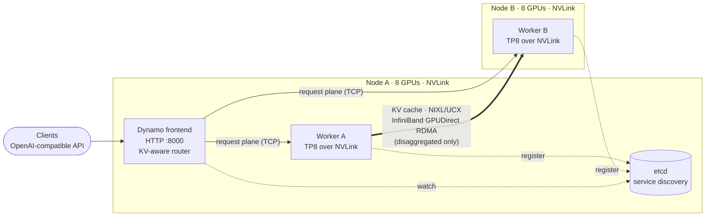
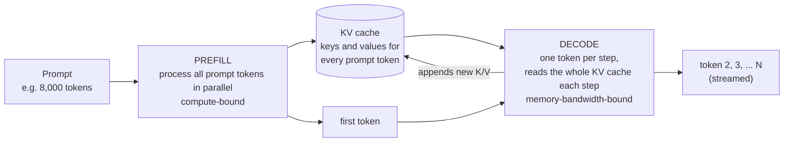
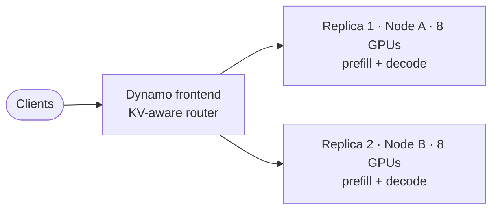
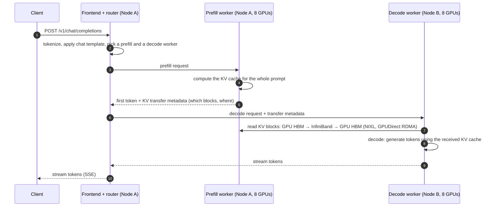
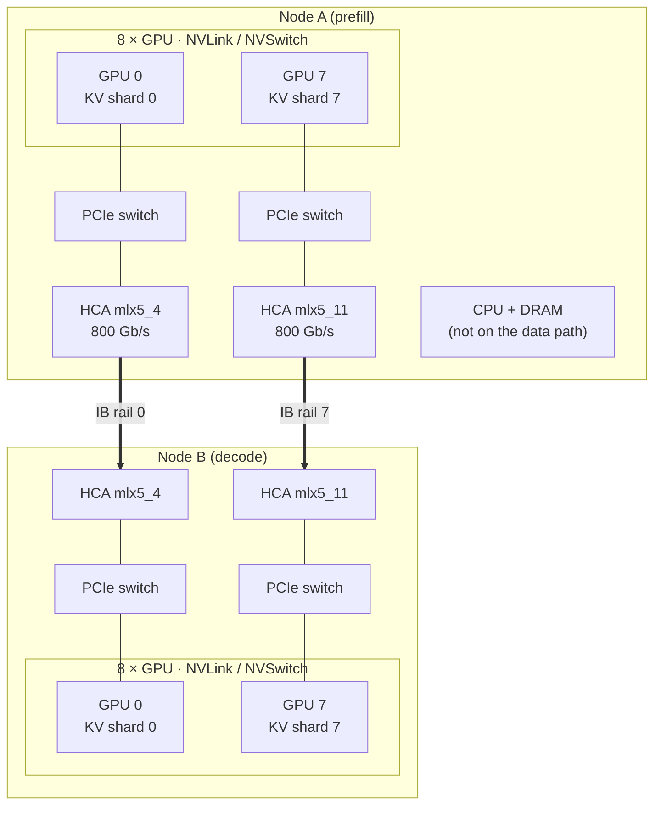
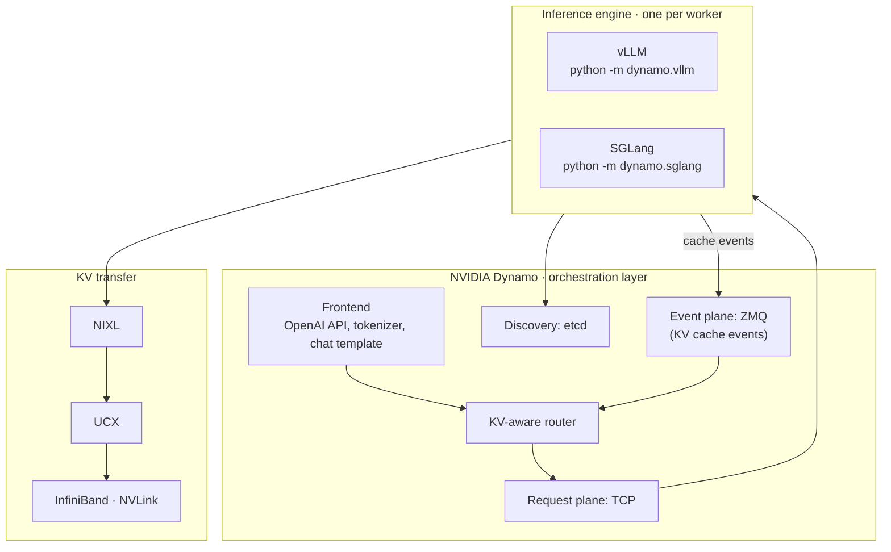

# 01 · Reference architecture and concepts

This section explains **what** gets deployed in the rest of the repository and **why**. Read it once before deploying anything. Everything later refers back to the terms and diagrams introduced here.

**Contents**

1. [The reference architecture at a glance](#1-the-reference-architecture-at-a-glance)
2. [How LLM inference works: prefill, decode and the KV cache](#2-how-llm-inference-works-prefill-decode-and-the-kv-cache)
3. [Aggregated serving](#3-aggregated-serving)
4. [Disaggregated serving](#4-disaggregated-serving)
5. [How the KV cache moves: NVLink, InfiniBand and GPUDirect RDMA](#5-how-the-kv-cache-moves-nvlink-infiniband-and-gpudirect-rdma)
6. [Software components](#6-software-components)
7. [Choosing aggregated or disaggregated](#7-choosing-aggregated-or-disaggregated)
8. [Where this is going: KV-cache offloading](#8-where-this-is-going-kv-cache-offloading)

---

## 1. The reference architecture at a glance

Two GPU servers, each with 8 GPUs connected internally by NVLink and externally by eight 800 Gb/s InfiniBand rails. The same hardware is deployed in two ways. Everything else in this repository is a variation of these two pictures.



| | **Aggregated** ([03](../03-aggregated/)) | **Disaggregated** ([04](../04-disaggregated-vllm/), [05](../05-disaggregated-sglang/)) |
|---|---|---|
| Worker A | Full replica: prefill **and** decode | **Prefill** only |
| Worker B | Full replica: prefill **and** decode | **Decode** only |
| KV cache crosses nodes | Never | Every request, over InfiniBand |
| Router's job | Pick the replica with the best prefix-cache hit | Send prefill to A, decode to B |
| Needs RDMA between nodes | No | Yes |

The reference hardware is two servers with 8 × NVIDIA B300 each. The design applies to any NVLink-connected 8-GPU server with RDMA networking. See [02-prerequisites](../02-prerequisites/) for exact requirements.

---

## 2. How LLM inference works: prefill, decode and the KV cache

Every request to a large language model runs in two phases with very different hardware profiles.



| | Prefill | Decode |
|---|---|---|
| Work | All prompt tokens at once, as big matrix multiplications | One new token per sequence per step |
| Bottleneck | GPU **compute** (FLOPs) | GPU **memory bandwidth** (reading weights and KV cache) |
| Latency metric it drives | **TTFT**: time to first token | **ITL / TPOT**: time between output tokens |
| Scales with | Prompt length | Output length × concurrent sequences |

**The KV cache** holds the attention keys and values for every token processed so far. Decode reads it at every step, so it must live in GPU memory (HBM). It grows linearly with context length and with the number of concurrent sequences. For long-context and agentic workloads, KV-cache capacity, not compute, is often what limits concurrency.

**Prefix caching** keeps KV blocks after a request finishes. A later request that starts with the same tokens can skip that part of prefill. Examples are the same system prompt, the same document, or the previous turns of a conversation. The **KV-aware router** in Dynamo uses this by sending each request to the worker that already holds the longest matching prefix.

---

## 3. Aggregated serving

In aggregated serving, each worker runs both phases for its requests. Scaling out means adding identical replicas.



**Strengths:** it is simple. No KV transfer means no RDMA requirement between nodes, and each replica is independent. It is the right baseline, and often the right answer for short prompts.

**The problem it cannot avoid is phase interference.** Prefill and decode share the same GPUs and the same batch. When a long prompt arrives, its prefill competes with the decode steps of every running sequence. Users who are mid-stream see output stall, which shows up as ITL spikes. Chunked prefill (`--max-num-batched-tokens` / `--chunked-prefill-size`) splits long prompts to soften this, but cannot remove it. You also cannot tune parallelism or batch size separately for each phase.

---

## 4. Disaggregated serving

Disaggregated serving puts prefill and decode on **separate GPU pools** and moves the KV cache between them.



This is the vLLM + NIXL flow, where decode *pulls* the blocks with RDMA reads (`UCX_RNDV_SCHEME=get_zcopy`). With SGLang, decode first contacts the prefill worker's bootstrap server on port 8998, and prefill then sends the KV cache to decode. Details vary between engine and Dynamo versions. The invariant is the same: **prefill computes the KV cache once, the KV cache moves over the fast fabric, and decode never recomputes it.**

**What you gain**

- **No phase interference.** Decode GPUs only decode, so ITL stays steady when long prompts arrive.
- **Independent tuning.** Each pool can use different batch sizes and memory settings, and in larger deployments different parallelism (for example TP8 prefill, wide expert-parallel decode).
- **Independent scaling.** Add prefill capacity for long prompts or decode capacity for long outputs. In production the Dynamo Planner can adjust the ratio automatically ([08](../08-production-readiness/)).

**What you pay**

- **A KV transfer on every request.** It is cheap on RDMA and expensive on TCP (see [section 5](#5-how-the-kv-cache-moves-nvlink-infiniband-and-gpudirect-rdma)).
- **More moving parts.** Two worker roles must match exactly (model, tensor parallelism, block size, KV dtype), and transfers must be monitored.
- **Not always faster.** With short prompts and a balanced load, aggregated replicas can match or beat disaggregation. **Always benchmark both** ([06](../06-benchmarking/)).

---

## 5. How the KV cache moves: NVLink, InfiniBand and GPUDirect RDMA

Disaggregation only works if the KV transfer is much faster than recomputing the prefill. Three interconnects matter.



### 5.1 Inside a node: NVLink and NVSwitch

With tensor parallelism of 8 (TP8), each layer is split across the 8 GPUs of one node. The GPUs exchange partial results at every layer (all-reduce), and this traffic runs over **NVLink/NVSwitch**, which is far faster than PCIe or networking. That is why a TP group should stay inside one NVLink domain. Each GPU also holds **its own shard of the KV cache**, the attention heads assigned to it.

If prefill and decode ran on different GPUs of the **same** node, the KV cache could move over NVLink using UCX's `cuda_ipc` transport. This repository puts them on different nodes to show the realistic multi-node case.

### 5.2 Between nodes: InfiniBand with GPUDirect RDMA

Between nodes, the KV cache travels over InfiniBand. Three technologies make that fast.

- **RDMA (Remote Direct Memory Access).** The network card (HCA) reads and writes remote memory directly. There are no kernel TCP stacks and no extra copies, and latency is a few microseconds.
- **GPUDirect RDMA.** The HCA reads from and writes to **GPU memory** directly over PCIe. KV blocks go from GPU HBM to the PCIe switch, the HCA, the fabric, the remote HCA, and remote GPU HBM. They never bounce through CPU memory. This requires the NVIDIA peer-memory support (`nvidia-peermem` or DMA-BUF) on the host.
- **Rail-optimized topology.** Each GPU has a nearby HCA under the same PCIe switch, one "rail" per GPU. In the reference servers these are `mlx5_4` … `mlx5_11`. GPU *i* on the prefill node sends its KV shard to GPU *i* on the decode node over its own rail, so all 8 rails work in parallel.

The software stack that drives this:

| Layer | What it does | Where you configure it |
|---|---|---|
| **NIXL** (NVIDIA Inference Xfer Library) | Engine-agnostic API to register memory and move KV blocks between workers. vLLM uses it through `NixlConnector`, SGLang through `--disaggregation-transfer-backend nixl`. | Engine flags in the worker manifests |
| **UCX** (Unified Communication X) | NIXL's transport. Chooses the RDMA verbs (`rc_x`, `rc`) and CUDA memory paths (`cuda_copy`, `cuda_ipc`). | `UCX_NET_DEVICES`, `UCX_TLS`, `UCX_RNDV_*` env vars |
| **InfiniBand verbs + GPUDirect RDMA** | The hardware data path | Host drivers, `/dev/infiniband`, memlock limits, `IPC_LOCK` |

The Ethernet interface (`eth0`) carries only **control** traffic: HTTP, etcd, Dynamo's request plane, NIXL metadata handshakes, and NCCL/Gloo bootstrap. A working `curl` between nodes proves nothing about the RDMA path. [02-prerequisites](../02-prerequisites/) tests the two paths separately.

### 5.3 Why the interconnect decides whether disaggregation pays off

A rough calculation for an illustrative dense 70B-class model (80 layers, 8 KV heads, head dimension 128, FP8 KV cache):

```text
KV bytes per token = 2 (K and V) × 80 layers × 8 heads × 128 dim × 1 byte ≈ 160 KiB
32,000-token prompt ≈ 5 GiB of KV cache to move
```

| Path | Approximate bandwidth | Time to move 5 GiB |
|---|---|---|
| 8 × 800 Gb/s InfiniBand rails, GPUDirect RDMA | ~800 GB/s aggregate | ~7 ms |
| 1 × 800 Gb/s rail | ~100 GB/s | ~55 ms |
| 25 GbE TCP through CPU memory | ~3 GB/s | ~1.8 s |

Prefilling 32,000 tokens takes on the order of seconds. The RDMA transfer is a small fraction of that, while TCP would erase the gain. These are line-rate figures; real transfers add protocol overhead. Hybrid models such as Nemotron 3 Ultra, which combines attention and Mamba layers, have KV cache only in their attention layers plus a fixed-size Mamba state per sequence, so they move less data than this dense example.

### 5.4 Multi-node NVLink (rack-scale systems)

On rack-scale systems such as GB200/GB300 NVL72, up to 72 GPUs share **one NVLink domain** across trays. Prefill and decode can sit in different trays and still exchange KV over NVLink, at several times the per-GPU bandwidth of an InfiniBand rail. NIXL/UCX use the same API, so the deployment model in this repository is unchanged. Only the transport underneath differs. NVIDIA's reference Dynamo recipes for GB200/GB300 use this path. The B300 servers here use InfiniBand between nodes.

---

## 6. Software components



| Component | Role in this repository | Port(s) |
|---|---|---|
| **Dynamo frontend** | OpenAI-compatible HTTP API, tokenization, chat templates, request routing | 8000 on Node A |
| **KV-aware router** | Part of the frontend (`--router-mode kv`). Tracks which worker holds which KV blocks, using worker events, and routes for maximum prefix reuse. | n/a |
| **etcd** | Service discovery. Workers register their endpoints and the frontend watches for them. | 2379 on Node A |
| **Request plane** | Frontend-to-worker RPC over TCP (`DYN_REQUEST_PLANE=tcp`) | dynamic |
| **Event plane** | Workers publish KV-cache events over ZMQ (`DYN_EVENT_PLANE=zmq`), so no NATS is needed | dynamic |
| **Worker** | A Dynamo wrapper around vLLM or SGLang, owning 8 GPUs with TP8 | 8081 for health and metrics |
| **NIXL + UCX** | KV-cache transfer between prefill and decode (disaggregated only) | 5600 for the vLLM side channel, 8998 for the SGLang bootstrap, plus RDMA |

**vLLM or SGLang?** Both are high-performance open-source engines. Dynamo wraps both with the same frontend, router and discovery, so you can compare them on identical hardware. Their flags and some behavior differ. See [reference/vllm-vs-sglang.md](../reference/vllm-vs-sglang.md).

**Why plain Deployments and not the Dynamo Kubernetes operator?** The Kubernetes manifests here are ordinary Deployments and Services, so every process, flag and port stays visible. For production, the Dynamo operator (`DynamoGraphDeployment`) adds lifecycle management, autoscaling and the Planner. See [08-production-readiness](../08-production-readiness/).

---

## 7. Choosing aggregated or disaggregated

| Workload signal | Leans aggregated | Leans disaggregated |
|---|---|---|
| Prompt length | Short (under a few thousand tokens) | Long (tens of thousands of tokens and up), RAG, agentic histories |
| Latency target | Mostly TTFT, or throughput only | Strict ITL/TPOT SLOs while long prompts arrive |
| Input:output ratio | Balanced or output-heavy | Input-heavy |
| Interconnect | No RDMA between nodes | InfiniBand/RoCE with GPUDirect RDMA, or multi-node NVLink |
| Operational maturity | Early PoC, small team | Teams able to operate two roles and monitor transfers |

**Rule of thumb:** deploy aggregated first to get a baseline, then deploy disaggregated on the same GPUs and compare with the same dataset. The repository is laid out in that order.

---

## 8. Where this is going: KV-cache offloading

GPU memory limits how much KV cache, and therefore how much reusable context, a worker can hold. The next step for this reference architecture is to extend the cache into a hierarchy: GPU HBM, then host DRAM, then local NVMe read directly by the GPU through **GPUDirect Storage**, then shared storage. That design and its roadmap are in [09-kv-cache-offloading](../09-kv-cache-offloading/).

---

**Next:** [02 · Prerequisites](../02-prerequisites/)
