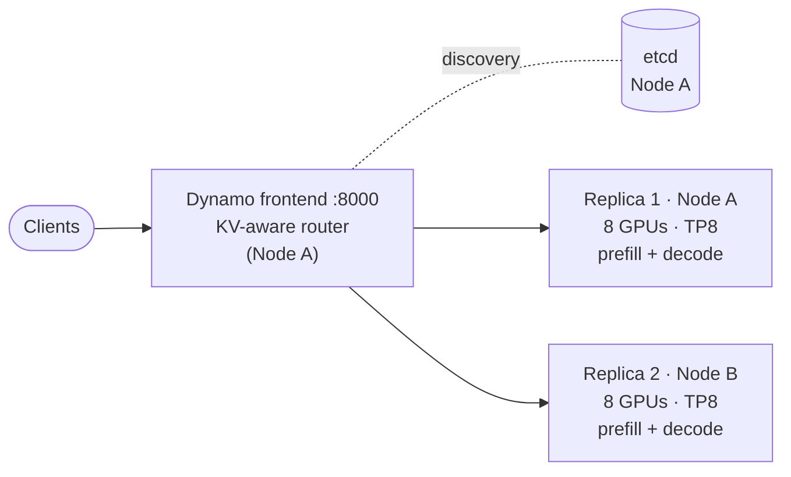

# 03 · Aggregated serving (baseline)

[Home](../README.md) › 03 · Aggregated

**Goal:** deploy the simplest production-shaped topology, where every worker serves complete requests, and measure it. This is the **baseline** that the disaggregated tracks are compared against.

**You will learn** how the Dynamo frontend, etcd and workers fit together, what each engine flag does, and how a KV-aware router spreads load across replicas without moving any KV cache between nodes.

## Pick your engine and platform

| Engine | Docker Compose | Kubernetes |
|---|---|---|
| **vLLM** (reference) | [vllm/docker](vllm/docker/) | [vllm/kubernetes](vllm/kubernetes/) |
| **SGLang** | [sglang/docker](sglang/docker/) | [sglang/kubernetes](sglang/kubernetes/) |

Each folder has a step-by-step README: deploy, verify, see results, clean up. Use the **same engine** here as in the disaggregated track you plan to compare against, so that [04](../04-disaggregated-vllm/) is compared with aggregated vLLM and [05](../05-disaggregated-sglang/) with aggregated SGLang.

**One node or two?**

- **One node (learning):** start only Node A. You get etcd, the frontend and one replica. Everything works, including the router.
- **Two nodes (fair baseline):** add the Node B replica. It uses the **same 16 GPUs** as the disaggregated tracks, so throughput numbers are comparable.

## What runs, and why

| Component | Node | What it does |
|---|---|---|
| `etcd` | A | Registry: each worker announces its endpoint; the frontend discovers workers here |
| `frontend` | A | OpenAI-compatible API on :8000. Tokenizes, applies the chat template, routes each request. |
| `worker` | A (and B) | `python -m dynamo.vllm` or `dynamo.sglang`: the engine on 8 GPUs with tensor parallelism 8, wrapped by Dynamo |

Aggregated workers need **no InfiniBand devices, no privileged mode and no NIXL**, because nothing crosses nodes except HTTP and TCP control traffic. Compare the worker files here with [04](../04-disaggregated-vllm/) to see exactly what disaggregation adds.

## The worker command, explained (vLLM)

These are the flags in [vllm/docker/node-a.yaml](vllm/docker/node-a.yaml) and [vllm/kubernetes/30-worker.yaml](vllm/kubernetes/30-worker.yaml).

| Flag | Value | Why |
|---|---|---|
| `--model` / `--served-model-name` | `/model`, the HF id | Local weights. The API name clients must send. |
| `--tensor-parallel-size` | 8 | Shard every layer across the 8 NVLink-connected GPUs of one node |
| `--no-enable-expert-parallel` | | Keep MoE experts tensor-parallel, as in NVIDIA's recipe for this model |
| `--max-model-len` | 32768 | Context window served. Start small; raise it once stable ([06](../06-benchmarking/)). |
| `--max-num-seqs` | 32 | Maximum concurrent sequences in a batch |
| `--max-num-batched-tokens` | 8192 | Per-step token budget. This is what makes prefill **chunked**, which limits how long a big prompt can stall decodes. |
| `--gpu-memory-utilization` | 0.80 | Share of HBM for weights plus KV cache. The rest is headroom. |
| `--block-size` | 64 | KV-cache page size in tokens. **Must equal** the frontend's `--kv-cache-block-size`. |
| `--kv-cache-dtype` | fp8 | Halves KV memory compared with BF16, so more context fits |
| `--enable-prefix-caching` | | Reuse KV blocks for repeated prefixes. The router depends on this. |
| `--attention-backend` … `--async-scheduling` | | Nemotron 3 Ultra's hybrid Mamba + attention kernels, from NVIDIA's recipe |
| `--reasoning-parser*`, `--dyn-*-parser` | | Split reasoning text and tool calls into OpenAI-compatible fields |
| `--kv-events-config` | ZMQ publisher | Worker reports cache changes, so the KV-aware router knows who holds which prefix |

The SGLang worker uses equivalent flags with different names, for example `--context-length` and `--mem-fraction-static`. See [reference/vllm-vs-sglang.md](../reference/vllm-vs-sglang.md).

## What to observe

1. **Throughput scales with replicas.** Run the step 8 benchmark with Node A alone, then with both nodes, at the same concurrency.
2. **Prefix-cache routing.** Repeat a long prompt. The second response has a much lower TTFT, and it comes from the same replica.
3. **Phase interference.** Run the benchmark at concurrency 8 with long prompts and look at the `itl_ms_p99` / `tpot_ms` columns. Stalls caused by prefill competing with decode appear there. This is the effect disaggregation targets.

Record the numbers. You will compare them in [06 · Benchmarking](../06-benchmarking/).

---

**Next:** [04 · Disaggregated with vLLM](../04-disaggregated-vllm/) · [05 · Disaggregated with SGLang](../05-disaggregated-sglang/)
