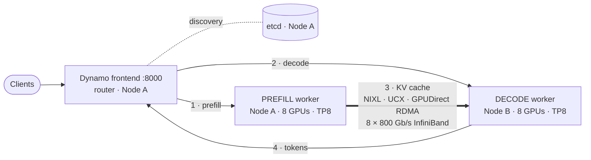

# 04 · Disaggregated serving with Dynamo + vLLM

[Home](../README.md) › 04 · Disaggregated vLLM

**Goal:** split prefill and decode onto separate 8-GPU pools on separate nodes, move the KV cache between them over InfiniBand with NIXL, and measure the difference against the [aggregated baseline](../03-aggregated/).

Read [01 · Architecture §4–5](../01-architecture/#4-disaggregated-serving) first if the terms prefill, decode, NIXL or GPUDirect RDMA are new.

## Pick your platform

| Platform | Deploy guide | Files |
|---|---|---|
| Docker Compose | [docker/README.md](docker/README.md) | [node-a.yaml](docker/node-a.yaml) (etcd, frontend, prefill), [node-b.yaml](docker/node-b.yaml) (decode) |
| Kubernetes | [kubernetes/README.md](kubernetes/README.md) | `00-namespace` … `30-prefill`, `31-decode` |

**Prerequisites beyond the aggregated track:** a passing `ib_write_bw` test on every rail ([02 §5](../02-prerequisites/#5-test-the-rdma-data-path)), GPUDirect RDMA on both hosts, and the model on **both** nodes.

## What changes compared with aggregated

Open [03-aggregated/vllm/docker/node-a.yaml](../03-aggregated/vllm/docker/node-a.yaml) and [docker/node-a.yaml](docker/node-a.yaml) side by side. The engine flags are identical except for the additions below. The repository's tests enforce this.

| Addition | Where | Purpose |
|---|---|---|
| `--disaggregation-mode prefill` / `decode` | worker command | Gives each worker one phase |
| `--kv-transfer-config '{"kv_connector":"NixlConnector","kv_role":"kv_both"}'` | worker command | vLLM's NIXL connector moves KV blocks. With `kv_both`, Dynamo, not the flag, decides the direction. |
| `VLLM_NIXL_SIDE_CHANNEL_HOST` / `_PORT` (5600) | env | Where workers exchange NIXL metadata (memory registrations, block addresses) over TCP |
| `UCX_NET_DEVICES` = the 8 `mlx5_*` HCAs | env | Pin UCX to the InfiniBand rails, never Ethernet |
| `UCX_TLS=rc_x,rc,cuda_copy,cuda_ipc` | env | RDMA reliable-connection transports plus CUDA memory support, which gives GPUDirect RDMA |
| `UCX_RNDV_SCHEME=get_zcopy`, `UCX_RNDV_THRESH=0` | env | Always use zero-copy RDMA reads, so decode pulls blocks straight from prefill's GPU memory |
| `DYN_VLLM_APPEND_PREFILL_OUTPUT_TOKENS=0` | env | Nemotron recipe setting for the prefill-to-decode hand-off |
| `/dev/infiniband`, `IPC_LOCK`, unlimited memlock, `privileged` (Kubernetes) | container | RDMA device access and pinned-memory registration |

**Invariant:** prefill and decode must use the same model revision, TP size, `--block-size` and `--kv-cache-dtype`. Otherwise the KV layouts do not match. Always restart **both** roles together.

## What to observe

1. **KV transfer is real.** Step 7 of each deploy guide shows three independent proofs: logs, worker metrics and InfiniBand port counters.
2. **Steadier inter-token latency.** At the same concurrency and dataset as the aggregated run, compare `itl_ms_p99` and `tpot_ms`. Decode no longer competes with prefill.
3. **TTFT includes the transfer.** TTFT equals prefill plus KV transfer plus the first decode step. With RDMA the transfer is small (see the table in [01 §5.3](../01-architecture/#53-why-the-interconnect-decides-whether-disaggregation-pays-off)).
4. **Throughput may go either way.** One prefill and one decode worker is a fixed 1:1 ratio. If your workload is decode-heavy, the decode node saturates first. Production systems tune this ratio or let the Dynamo Planner adjust it ([08](../08-production-readiness/)).

## Status and known limits

- The worker settings reproduce the manual deployment in [reference/manual-docker-walkthrough.md](../reference/manual-docker-walkthrough.md). There, both workers initialized and registered with this exact image and revision. End-to-end RDMA transfer and performance still need to be verified on your hosts.
- Nemotron 3 Ultra is a hybrid model: NIXL moves both attention KV blocks and Mamba state. Keep the pinned image. Do not upgrade vLLM inside it.

---

**Next:** [05 · Disaggregated with SGLang](../05-disaggregated-sglang/) · [06 · Benchmarking](../06-benchmarking/)
