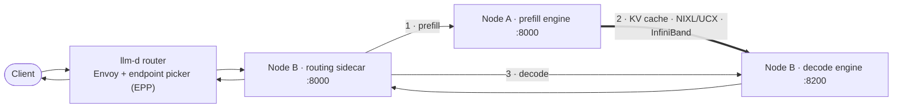

# 07 · llm-d: an alternative disaggregated stack (optional)

[Home](../README.md) › 07 · llm-d

[llm-d](https://github.com/llm-d/llm-d) is a Kubernetes-native alternative to Dynamo for disaggregated serving. It uses the same engines and the same NIXL KV transfer, but routes through the Kubernetes Gateway API Inference Extension. This section lets you compare the **orchestration layer** on identical hardware. Skip it if you only need Dynamo.

| | Dynamo (04/05) | llm-d (this section) |
|---|---|---|
| Entry point | Dynamo frontend (Python, OpenAI API) | Envoy proxy + endpoint picker, installed by Helm chart |
| Discovery | etcd | Kubernetes labels + `InferencePool` CRD |
| P/D coordination | Dynamo frontend and worker wrappers | Routing sidecar next to the decode engine |
| Engines | `dynamo.vllm` / `dynamo.sglang` | Stock `vllm serve` / `sglang.launch_server` |
| Platform | Docker or Kubernetes | Kubernetes only (1.33+ for native sidecars) |

## Deploy

| Engine | Deploy guide |
|---|---|
| vLLM 0.30.0 | [kubernetes/vllm/README.md](kubernetes/vllm/README.md) |
| SGLang 0.5.20 | [kubernetes/sglang/README.md](kubernetes/sglang/README.md) |

**Different model from the Dynamo tracks.** These manifests serve `Qwen/Qwen3-Coder-480B-A35B-Instruct-FP8` from `/data/models/qwen-480b`. To compare fairly with Dynamo, deploy the Dynamo track with the same model ([reference/models.md](../reference/models.md#switching-a-reference-deployment-to-another-model)), or regenerate these files for Nemotron with `tools/render.py --target llmd` ([tools/](../tools/)).

**Generated files.** Unlike tracks 03 to 05, these manifests were produced by [tools/render.py](../tools/render.py). They are plain YAML and readable, but not hand-annotated. The pinned versions are llm-d guide v0.10.0 and router/sidecar v0.11.0. See [reference/sources.md](../reference/sources.md).

---

**Next:** [08 · Production readiness](../08-production-readiness/)
