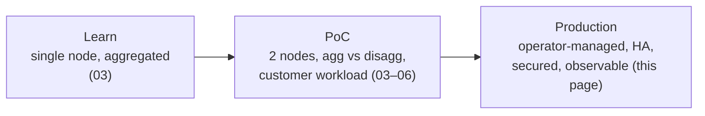

# 08 · From reference deployment to production

[Home](../README.md) › 08 · Production readiness

The deployments in 03 to 05 are deliberately transparent: plain Compose files and Deployments, single etcd, host networking, privileged RDMA and `hostPath` weights. That makes them ideal for learning and for customer PoCs. This page lists what to change before production traffic, and why.

## Stages

| Area | Reference deployment (lab / PoC) | Production recommendation |
|---|---|---|
| Orchestration | Plain Deployments / Compose | **Dynamo Kubernetes operator** with `DynamoGraphDeployment` (DGD): managed prefill/decode lifecycle, coordinated updates, the Planner |
| Scaling | Fixed 1 prefill : 1 decode, or N aggregated replicas | Dynamo **Planner** adjusts the prefill:decode ratio from TTFT/ITL SLOs and load. Capacity planned from the benchmarks in 06. |
| Discovery | Single etcd, no TLS, ephemeral (K8s) | 3-node etcd with TLS and auth, or the operator-managed control plane. Backups if state matters. |
| API security | Plain HTTP on :8000, private network only | TLS termination and authentication at an ingress or API gateway. Rate limits and per-tenant quotas. Never expose 8000, 2379 or worker ports publicly. |
| Network exposure | `hostNetwork`, bind on node IPs | Keep host networking only where RDMA needs it. NetworkPolicies and host firewalls limit east-west ports to the serving nodes. |
| RDMA access | `privileged: true` + `/dev/infiniband` | NVIDIA **Network Operator** with an RDMA device plugin (shared or SR-IOV). Unprivileged pods request `rdma/...` resources and keep `IPC_LOCK`. |
| GPU stack | Host-installed drivers | NVIDIA **GPU Operator**: pinned driver, device plugin, DCGM exporter, and GDS when offloading ([09](../09-kv-cache-offloading/)) |
| Model weights | `hostPath`, downloaded by hand per node | Read-only shared volume (a PVC on a high-throughput filesystem) or pre-staged local NVMe managed by a job. Pinned revision verified at startup, as the reference workers already do. |
| Images | Dynamo vLLM image pinned by digest; SGLang by tag | **Every** image pinned by digest, mirrored to a private registry, scanned, and promoted through environments |
| Rollouts | Stop both roles, then start both | Operator-coordinated rollouts. Blue/green at the router or gateway for model upgrades. |
| Observability | `curl .../metrics`, `docker logs` | Prometheus scraping workers (:8081) and the frontend, DCGM GPU metrics, InfiniBand port counters, NIXL transfer metrics. Grafana dashboards. Centralized logs. Alerts on TTFT/ITL SLOs, transfer errors and GPU XID errors. |
| Health | Startup plus readiness probes, no liveness | Keep a long startup window and no aggressive liveness probe. Add synthetic end-to-end probes through the public endpoint. |
| Capacity headroom | `gpu-memory-utilization 0.80`, 32K context | Tuned from benchmarks: context, `max-num-seqs`, batch token budget and memory fraction per role. Change one variable at a time. |
| Reliability | One prefill and one decode: either failing stops service | At least N+1 workers per role, spread over failure domains. The frontend replicated behind a Service. |
| Compliance | Benchmark logs keep prompts and outputs (`requests.jsonl`) | Decide the retention policy for prompts and outputs. Redact traces used for benchmarking. |

## Validation gates before go-live

1. **RDMA proven:** `ib_write_bw` (GPU memory) on every rail, and NIXL transfers visible in metrics and IB counters under load.
2. **Functional:** chat, streaming, tool calls and reasoning fields validated against the client applications.
3. **Performance:** a sweep on the customer's real or representative traces meets the TTFT/ITL SLOs at target concurrency, with 3 or more repetitions.
4. **Resilience:** kill a decode worker, a prefill worker and the frontend in turn. Measure the impact and recovery time.
5. **Soak:** 24 hours or more at expected load with no memory growth, transfer errors or XID events.
6. **Runbook:** a copy of [reference/troubleshooting.md](../reference/troubleshooting.md), adapted to the customer's environment, is handed to operations.

## Sizing beyond two nodes

- **More aggregated replicas:** label more nodes and scale the worker Deployment ([03 Kubernetes guide](../03-aggregated/vllm/kubernetes/README.md#scaling-the-aggregated-replicas)).
- **Different prefill:decode ratios:** input-heavy traffic (RAG, agents) needs more prefill, while long generations need more decode. Measure first; the Planner automates this.
- **Rack-scale NVLink** (GB200/GB300 NVL72): prefill and decode inside one NVLink domain, with wide expert parallelism for large MoE decode. NVIDIA's Dynamo recipes publish reference configurations for these systems ([reference/sources.md](../reference/sources.md)).

---

**Next:** [09 · KV-cache offloading (future work)](../09-kv-cache-offloading/)
