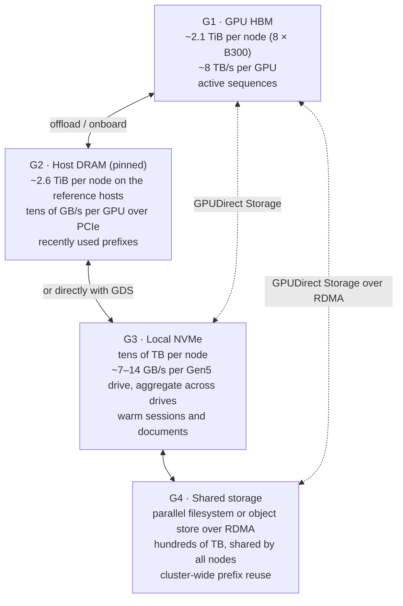
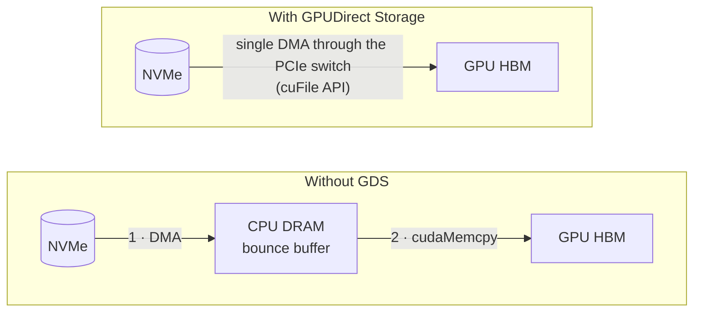
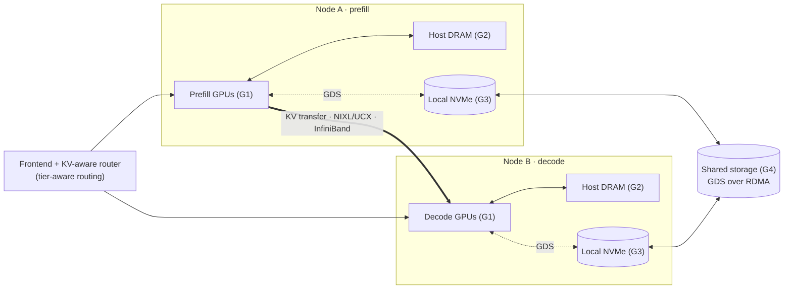

# 09 · KV-cache offloading to host memory and NVMe with GPUDirect Storage

[Home](../README.md) › 09 · KV-cache offloading

> **Status: future work.** This section is the design and roadmap for the next addition to this reference architecture. Nothing here is deployed by tracks 03 to 05, and no configuration on this page has been validated on the reference hosts. Flag and variable names are taken from upstream documentation at the time of writing. Confirm them against the pinned releases before use.

**Contents**

1. [Why offload the KV cache](#1-why-offload-the-kv-cache)
2. [The KV-cache memory hierarchy](#2-the-kv-cache-memory-hierarchy)
3. [GPUDirect Storage: NVMe straight into GPU memory](#3-gpudirect-storage-nvme-straight-into-gpu-memory)
4. [Offloading in a disaggregated deployment](#4-offloading-in-a-disaggregated-deployment)
5. [Software options](#5-software-options)
6. [Roadmap](#6-roadmap)
7. [Host preparation preview](#7-host-preparation-preview)
8. [How success will be measured](#8-how-success-will-be-measured)

---

## 1. Why offload the KV cache

Section 2 of [01 · Architecture](../01-architecture/#2-how-llm-inference-works-prefill-decode-and-the-kv-cache) showed that the KV cache must be in GPU memory while a sequence decodes. GPU memory is the scarcest resource in the system. Once a request finishes, or an agent pauses to run a tool, its KV blocks are **evicted** to make room. When the same conversation or document comes back, the whole prefix has to be **recomputed**.

An illustrative example, using the dense 70B-class model from [01 §5.3](../01-architecture/#53-why-the-interconnect-decides-whether-disaggregation-pays-off) with about 160 KiB of KV per token:

| | Value |
|---|---|
| KV for one 256K-token agent session | ≈ 40 GiB |
| GPU memory left for KV on one 8-GPU node | roughly 1.3–1.5 TiB, so only a few dozen such sessions stay resident |
| Recompute that prefix (prefill) | many seconds of all 8 GPUs, repeated on **every** return to the session |
| Reload it from local NVMe at ~50 GB/s aggregate | ≈ 0.8 s, with GPUs free for other work |
| Reload it from host DRAM at ~100 GB/s or more | ≈ 0.4 s |

Offloading turns "evict and recompute" into "evict to a cheaper tier and reload". The payoff is largest for **multi-turn chat, agentic workflows, RAG over shared documents, and long shared system prompts**. These are the workloads this repository's benchmarks already model.

---

## 2. The KV-cache memory hierarchy



| Tier | Capacity | Latency and bandwidth | Scope | Typical content |
|---|---|---|---|---|
| **G1** GPU HBM | Smallest | Fastest | One worker | Sequences being decoded |
| **G2** Host DRAM | Similar to or larger than HBM | Fast, over PCIe or C2C | One node | Hot prefixes evicted from HBM |
| **G3** Local NVMe | 10× or more | Moderate. GDS avoids CPU copies. | One node | Warm sessions, repeated documents |
| **G4** Shared storage | Largest | Network-bound | Whole cluster | Prefixes reusable by **any** worker |

The G1 to G4 naming follows NVIDIA Dynamo's KV Block Manager (KVBM).

**Capacity note for the reference hosts:** each node showed 973 GiB free on the root filesystem, which is already used by the model and images. A G3 tier needs **dedicated NVMe drives** mounted separately, for example `/mnt/kvcache`.

---

## 3. GPUDirect Storage: NVMe straight into GPU memory

Without GPUDirect Storage (GDS), reading KV blocks from NVMe goes through CPU memory. The data is DMA'd from the drive into a host bounce buffer, then copied again into GPU memory. That costs two transfers, CPU time and host memory bandwidth.

With GDS, the NVMe controller DMAs **directly into GPU HBM** across the PCIe switch that the drive and the GPU share. This is the storage counterpart of GPUDirect RDMA on the network side.



**What GDS needs**

| Requirement | Detail |
|---|---|
| Kernel support | The `nvidia-fs` kernel module from the `nvidia-gds` package, or upstream P2PDMA support on newer driver and kernel combinations. On Kubernetes, the NVIDIA GPU Operator can deploy it (its GDS option). |
| Filesystem | Local ext4 or XFS on NVMe with `O_DIRECT`, or a GDS-enabled distributed filesystem for G4 (several parallel filesystems support GDS over RDMA). Check the GDS release notes for supported RAID and filesystem combinations. |
| PCIe topology | Best when each GPU has an NVMe drive under the **same PCIe switch**, just as each GPU has a nearby HCA for RDMA. Check with `nvidia-smi topo -m` and `lspci -tv`. |
| Application API | cuFile, used indirectly: **NIXL** provides GDS backends (`GDS`, `GDS_MT`) alongside its UCX network backend. The same library that moves KV between prefill and decode can move it to and from storage. |
| Validation tools | `gdscheck -p` for the platform check and `gdsio` for throughput, both shipped with GDS |

---

## 4. Offloading in a disaggregated deployment

Offloading and disaggregation work well together. The prefill worker produces KV blocks, NIXL ships them to decode over InfiniBand, and the tiers keep them reusable after the request ends.



What changes for a request:

1. The router checks all tiers for the longest cached prefix, not only GPU memory.
2. The prefill worker **onboards** cached blocks from G2, G3 or G4 instead of recomputing them, and computes only the new suffix.
3. KV moves to decode over InfiniBand exactly as today.
4. When blocks are evicted from HBM, they are **offloaded** down the hierarchy instead of being discarded.

Open design questions for this repository:

- Which role should own the tiers: prefill only (simplest), both roles, or a shared G4 tier only?
- Should the tier be write-through or write-back, and what eviction policy should each tier use?
- How does offloaded **Mamba state** for hybrid models like Nemotron 3 Ultra behave compared with attention KV blocks?
- What is the security model for shared storage? Cached KV encodes prompt content, so encryption at rest and tenant isolation are required.

---

## 5. Software options

| Option | Engines | Tiers | Notes |
|---|---|---|---|
| **Dynamo KVBM** (KV Block Manager) | vLLM (and TensorRT-LLM) through a Dynamo connector | G1 to G4 | Native to the Dynamo stack used here. Uses NIXL for tier moves, including GDS. Can combine with the NIXL P/D transfer. |
| **LMCache** | vLLM (and SGLang) connectors | CPU, local disk, remote backends | Open-source KV caching layer with its own P/D support |
| **vLLM native offloading** | vLLM | CPU (G2) | Built-in offloading connector. The simplest first step. |
| **SGLang HiCache** | SGLang | Host memory plus pluggable storage backends (file, NIXL and others) | Hierarchical radix cache. The SGLang equivalent for track 05. |
| **NIXL storage backends** | Library used by the options above | GDS, GDS_MT, POSIX, object | The data mover underneath. Relevant when tuning I/O. |

**Candidate configuration sketch (unvalidated).** Dynamo's KVBM documentation describes enabling it on a vLLM worker roughly like this:

```bash
# Illustrative only. Verify names against the pinned Dynamo release before use.
export DYN_KVBM_CPU_CACHE_GB=512        # G2 host-memory tier per worker
export DYN_KVBM_DISK_CACHE_GB=4096      # G3 disk tier per worker
python3 -m dynamo.vllm <existing flags> --connector kvbm           # aggregated
python3 -m dynamo.vllm <existing flags> --connector kvbm nixl      # disaggregated: offload + P/D transfer
```

For SGLang, HiCache is enabled with flags such as `--enable-hierarchical-cache`, `--hicache-ratio` and `--hicache-storage-backend`. These are also unvalidated here.

---

## 6. Roadmap

| Phase | Deliverable in this repository | Exit criteria |
|---|---|---|
| **0 · Host readiness** | `09-kv-cache-offloading/host-setup/`: NVMe layout, GDS install, `gdscheck`, `gdsio` baselines, GPU Operator GDS option for Kubernetes | `gdscheck -p` reports GDS supported. `gdsio` GPU-direct reads reach the expected drive bandwidth on every GPU. |
| **1 · Host-memory tier (G2)** | Aggregated vLLM with KVBM or native offloading, as Compose and Kubernetes variants of track 03 | Multi-turn benchmark: lower TTFT on returning turns than track 03 under forced eviction. No correctness regressions. |
| **2 · Local NVMe tier with GDS (G3)** | G2 plus G3 on aggregated vLLM, then on the disaggregated track 04 (`kvbm` + `nixl`) | Measured G3 hit rate and bytes read by GDS. TTFT gain over G2-only at larger working sets. |
| **3 · Shared tier (G4)** | Shared GDS-capable filesystem tier; cross-node prefix reuse | A prefix computed on Node A is reused by a worker on Node B |
| **4 · SGLang parity** | HiCache variants of tracks 03 and 05 | Same benchmark, same dataset, compared with the vLLM results |

Planned layout:

```text
09-kv-cache-offloading/
├── README.md                       (this design)
├── host-setup/                     phase 0: NVMe + GDS preparation and checks
├── aggregated-vllm-offload/        phase 1–2: docker/ and kubernetes/, like track 03
├── disaggregated-vllm-offload/     phase 2–3: docker/ and kubernetes/, like track 04
└── sglang-hicache/                 phase 4
```

---

## 7. Host preparation preview

Guidance for phase 0, to be turned into a tested runbook. **Both nodes:**

```bash
nvidia-smi topo -m                 # GPU ↔ NVMe ↔ NIC PCIe affinity
lspci -tv | less                   # which drives share a switch with which GPU
nvme list                          # available NVMe drives

# Install GDS matching your CUDA/driver version (NVIDIA repository), then:
lsmod | grep nvidia_fs             # kernel module loaded
/usr/local/cuda/gds/tools/gdscheck -p

# Dedicated filesystem for the KV tier (example: one XFS per drive)
sudo mkfs.xfs /dev/nvme1n1 && sudo mkdir -p /mnt/kvcache0 && sudo mount -o noatime /dev/nvme1n1 /mnt/kvcache0

# GPU-direct read throughput from GPU 0 (-x 0 = GPUDirect, -I 0 = read)
/usr/local/cuda/gds/tools/gdsio -f /mnt/kvcache0/gdsio.dat -d 0 -w 8 -s 10G -i 1M -x 0 -I 0
```

Containers will additionally need the GDS user-space library, the NVMe mount and, depending on the setup, `/dev/nvidia-fs*` devices. These details will be captured in the phase 0 runbook.

---

## 8. How success will be measured

This reuses the existing benchmark tooling ([06](../06-benchmarking/)):

- **Workload:** the `agentic` dataset with `--think-time` long enough that sessions are evicted from HBM between turns, and a session count large enough that the working set exceeds GPU memory.
- **Compare:** the same track with and without offloading, same dataset, same concurrency.
- **Primary metric:** TTFT on turns 2 and later (prefix reuse), with p50 and p99.
- **Secondary metrics:** cache hit rate per tier, bytes read from each tier, GPU prefill time saved, output throughput, and CPU and host-memory load (GDS should keep CPU usage low).
- **Guardrails:** identical outputs at temperature 0 with and without offloading. No increase in failed requests.

---

**Back to:** [Home](../README.md) · [01 · Architecture](../01-architecture/)
