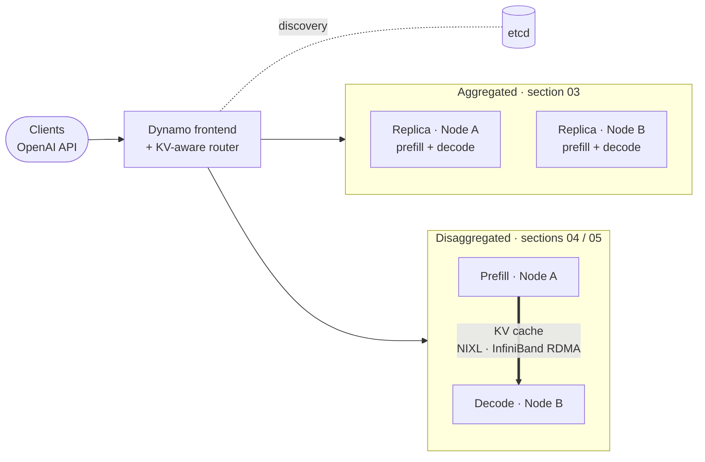

# LLM Serving Reference Architecture: Aggregated and Disaggregated Inference with NVIDIA Dynamo

A reference architecture and set of deployments for serving large language models on multi-GPU servers. It takes you from a single aggregated replica to **disaggregated prefill/decode serving**, where the KV cache moves between nodes over **InfiniBand with GPUDirect RDMA**. Every step runs on **Docker Compose or Kubernetes**, with **vLLM or SGLang** as the engine.

Every deployment file is hand-written and commented, and every step is explained. You can read exactly what runs, deploy it, and measure it.



---

## Table of contents

| # | Section | What you get |
|---|---|---|
| 01 | [**Architecture and concepts**](01-architecture/) | Reference architecture diagrams. Prefill, decode and the KV cache. Aggregated versus disaggregated serving. How the KV cache moves over **NVLink, InfiniBand and GPUDirect RDMA**. Dynamo components. |
| 02 | [**Prerequisites**](02-prerequisites/) | Hardware, software, ports, RDMA test, model download, Docker or Kubernetes setup |
| 03 | [**Aggregated serving (baseline)**](03-aggregated/) | Dynamo + vLLM or SGLang, one or two full replicas. Start here. |
| 04 | [**Disaggregated serving · vLLM**](04-disaggregated-vllm/) | Prefill on Node A, decode on Node B, KV transfer with NIXL over InfiniBand |
| 05 | [**Disaggregated serving · SGLang**](05-disaggregated-sglang/) | The same split with SGLang workers |
| 06 | [**Benchmarking and comparison**](06-benchmarking/) | One dataset, every track: TTFT, ITL, throughput, and a comparison notebook |
| 07 | [**llm-d (optional)**](07-llm-d/) | An alternative Kubernetes-native disaggregation stack, for comparison |
| 08 | [**Production readiness**](08-production-readiness/) | What to change between PoC and production: operator, HA, security, RDMA device plugin, observability |
| 09 | [**KV-cache offloading (future work)**](09-kv-cache-offloading/) | Design and roadmap: KV tiers in host DRAM, **local NVMe with GPUDirect Storage**, and shared storage |
| · | [Reference](reference/) | Model switching, vLLM versus SGLang mapping, troubleshooting, pinned sources, the original manual walkthrough |

### Deployment matrix

Every cell links to a folder with a step-by-step README: deploy, verify, see results, clean up.

| Track | Docker Compose | Kubernetes |
|---|---|---|
| 03 · Aggregated · vLLM | [03-aggregated/vllm/docker](03-aggregated/vllm/docker/) | [03-aggregated/vllm/kubernetes](03-aggregated/vllm/kubernetes/) |
| 03 · Aggregated · SGLang | [03-aggregated/sglang/docker](03-aggregated/sglang/docker/) | [03-aggregated/sglang/kubernetes](03-aggregated/sglang/kubernetes/) |
| 04 · Disaggregated · vLLM | [04-disaggregated-vllm/docker](04-disaggregated-vllm/docker/) | [04-disaggregated-vllm/kubernetes](04-disaggregated-vllm/kubernetes/) |
| 05 · Disaggregated · SGLang | [05-disaggregated-sglang/docker](05-disaggregated-sglang/docker/) | [05-disaggregated-sglang/kubernetes](05-disaggregated-sglang/kubernetes/) |
| 07 · llm-d · vLLM / SGLang | n/a | [07-llm-d/kubernetes](07-llm-d/kubernetes/) |

---

## Choose your path

| You are… | Follow | Outcome |
|---|---|---|
| **Learning** how LLM serving and disaggregation work | 01 → 02 → 03 on a single node → 04 | A running aggregated deployment, then a disaggregated one, and an understanding of every flag |
| **Running a customer PoC** | 01 §7 → 02 → 03 (two nodes) → 04 or 05 → 06 with the customer's workload | A like-for-like measurement of aggregated against disaggregated on the customer's traffic shape |
| **Planning production** | The PoC path, then 08, then 09 | A gap list from reference deployment to production, and the offloading roadmap |

---

## Repository map

```text
.
├── README.md                     ← you are here
├── cluster.env.example           site settings for the Docker path (IPs, interface, IB devices, paths)
├── 01-architecture/              concepts and diagrams
├── 02-prerequisites/             hardware, network, RDMA test, model download
├── 03-aggregated/
│   ├── vllm/   {docker, kubernetes}
│   └── sglang/ {docker, kubernetes}
├── 04-disaggregated-vllm/        {docker, kubernetes}
├── 05-disaggregated-sglang/      {docker, kubernetes}
├── 06-benchmarking/              how to measure and compare
├── 07-llm-d/kubernetes/          {vllm, sglang}   (optional alternative stack)
├── 08-production-readiness/
├── 09-kv-cache-offloading/       future work: NVMe + GPUDirect Storage KV tiers
├── reference/                    models, vLLM vs SGLang, troubleshooting, sources, manual walkthrough
├── benchmarks/                   benchmark code (python -m benchmarks.*)
├── datasets/seeds/               synthetic seed workloads
├── notebooks/compare.ipynb       comparison report
├── tools/                        optional helpers: download, preflight, render, validate, sweep
├── configs/                      model catalog and cluster inputs for the tools
└── tests/                        offline consistency and unit tests
```

Each deployment folder contains:

- **Docker:** `node-a.yaml`, `node-b.yaml`, `deployment.json` (the run record for benchmarks) and a README.
- **Kubernetes:** numbered manifests (`00-namespace`, `01-site-config`, `10-etcd`, `20-frontend`, `30-*` workers), a `kustomization.yaml`, `deployment.json` and a README.

---

## Reference stack

| Component | Version / value |
|---|---|
| Hardware | 2 servers × 8 NVIDIA B300, NVLink within each node, 8 × 800 Gb/s InfiniBand rails per node |
| Model | NVIDIA Nemotron 3 Ultra 550B-A55B NVFP4, revision `252a02f9…` ([other models](reference/models.md)) |
| Orchestration | NVIDIA Dynamo 1.4.0: frontend, KV-aware router, etcd discovery, TCP request plane, ZMQ event plane |
| Engines | vLLM 0.26.0 (Dynamo vLLM runtime, pinned by digest) · SGLang 0.5.16 base (Dynamo SGLang runtime) |
| KV transfer | NIXL over UCX, `rc_x`/`rc` + CUDA transports, GPUDirect RDMA |
| Parallelism | TP8 per worker. 32K context, 32 sequences and 0.80 memory share as the starting point. |

Full pins and upstream references are in [reference/sources.md](reference/sources.md).

## Validation status

- **Deployment files:** YAML, Compose and Kubernetes structure, and every embedded launch script are checked by the offline test suite (`python -m pytest -q`). The tests also check that the hand-written files launch the same engine flags and environment as the model catalog, and that aggregated and disaggregated workers differ only in their transfer settings.
- **On hardware:** the disaggregated vLLM worker configuration reproduces the [manual deployment](reference/manual-docker-walkthrough.md), in which both workers initialized and registered with this image and model revision. End-to-end RDMA KV transfer, the SGLang tracks, the Kubernetes manifests and llm-d have **not yet been run** on the reference hosts.
- **Performance:** no benchmark results are included, and none are fabricated. Section 06 explains how to produce them.

## Conventions

- Run commands **from the repository root**. Each step says which node it runs on.
- Only one track runs at a time, because each uses all 8 GPUs per node and the same host ports. Stop one before starting the next.
- Tracks are self-contained. Docker files read site values from `cluster.env`. Kubernetes manifests take placement from node labels and site values from `01-site-config.yaml`.
