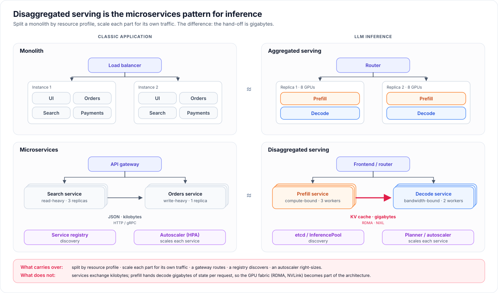

# LLM Inference Blueprint

**A reference architecture and deployment kit for serving large language models in production.**

This repository describes the LLM serving stack as an **operating system for inference**:

- **Control plane:** llm-d or NVIDIA Dynamo.
- **Engines:** TensorRT-LLM, vLLM or SGLang.
- **Models:** dense, MoE, MLA and hybrid Mamba architectures.
- **Hardware:** Hopper, Blackwell and Rubin GPUs, connected by NVLink and InfiniBand or RoCE, with storage attached directly to GPUs for KV-cache offloading.

It turns that architecture into **hand-written, runnable deployments** of aggregated and disaggregated serving, plus a benchmark kit that measures every option the same way.


## Why disaggregated serving

Prefill is compute-bound and decode is memory-bandwidth-bound. Running both on the same GPUs makes them interfere with each other and forces one scaling unit. **Disaggregated serving splits them into services that scale independently. It is the microservices pattern applied to inference.** There is one difference: prefill hands decode *gigabytes* of KV cache per request, so the GPU fabric becomes part of the architecture.



---

## What's inside

| Part | For | Contents |
|---|---|---|
| **[Blueprint](blueprint/)** | Architects, platform and ML engineers | 11 chapters: the stack, design principles, disaggregation, control planes, engines, model architectures, hardware and fabrics, KV caching and offloading, parallelism and sizing, operations, decision guide |
| **[Deployments](deployments/)** | Engineers running PoCs and labs | Step-by-step Docker Compose and Kubernetes deployments: aggregated, Dynamo disaggregated on vLLM and SGLang, llm-d disaggregated |
| **[Benchmarks](benchmarks/)** | Anyone comparing options | Long-context chat and agentic workloads, TTFT/ITL/throughput metrics, a comparison notebook |
| **[Reference](reference/)** | Operators | Model catalog and switching, vLLM ↔ SGLang mapping, troubleshooting, pinned sources |
| **[Roadmap](ROADMAP.md)** | Everyone | TensorRT-LLM tracks, KV-cache offloading with GPUDirect Storage, wide-EP on NVL72 |

## Blueprint chapters

| # | Chapter | # | Chapter |
|---|---|---|---|
| 01 | [The serving stack](blueprint/01-serving-stack.md) | 07 | [Hardware, network and storage](blueprint/07-hardware-network-storage.md) |
| 02 | [Design principles](blueprint/02-design-principles.md) | 08 | [KV cache and offloading](blueprint/08-kv-cache-and-offloading.md) |
| 03 | [The disaggregation pattern](blueprint/03-disaggregation-pattern.md) | 09 | [Parallelism and sizing](blueprint/09-parallelism-and-sizing.md) |
| 04 | [Orchestration layer: Dynamo and llm-d](blueprint/04-orchestration-layer.md) | 10 | [Production operations](blueprint/10-production-operations.md) |
| 05 | [Inference engines: TensorRT-LLM, vLLM, SGLang](blueprint/05-inference-engines.md) | 11 | [Decision guide](blueprint/11-decision-guide.md) |
| 06 | [Model architectures](blueprint/06-model-architectures.md) | | |

## Deployment matrix

| # | Track | Control plane | Engine | Docker | Kubernetes |
|---|---|---|---|---|---|
| 00 | [Prerequisites](deployments/00-prerequisites/) | | | ✓ | ✓ |
| 01 | [Aggregated (baseline)](deployments/01-aggregated/) | Dynamo | vLLM · SGLang | [vLLM](deployments/01-aggregated/vllm/docker/) · [SGLang](deployments/01-aggregated/sglang/docker/) | [vLLM](deployments/01-aggregated/vllm/kubernetes/) · [SGLang](deployments/01-aggregated/sglang/kubernetes/) |
| 02 | [Disaggregated](deployments/02-dynamo-disagg-vllm/) | Dynamo | vLLM | [guide](deployments/02-dynamo-disagg-vllm/docker/) | [guide](deployments/02-dynamo-disagg-vllm/kubernetes/) |
| 03 | [Disaggregated](deployments/03-dynamo-disagg-sglang/) | Dynamo | SGLang | [guide](deployments/03-dynamo-disagg-sglang/docker/) | [guide](deployments/03-dynamo-disagg-sglang/kubernetes/) |
| 04 | [Disaggregated](deployments/04-llm-d-disagg/) | llm-d | vLLM · SGLang | | [vLLM](deployments/04-llm-d-disagg/vllm/) · [SGLang](deployments/04-llm-d-disagg/sglang/) |
| · | TensorRT-LLM, KV offloading | Dynamo | TensorRT-LLM · vLLM | [roadmap](ROADMAP.md) | [roadmap](ROADMAP.md) |

## Choose your path

| You are… | Follow | Outcome |
|---|---|---|
| **Learning** LLM serving | [Blueprint 01–03](blueprint/) → [deployments 00](deployments/00-prerequisites/) → [01](deployments/01-aggregated/) on one node → [02](deployments/02-dynamo-disagg-vllm/) | A working aggregated and disaggregated deployment, with every flag explained |
| **Running a customer PoC** | [Decision guide](blueprint/11-decision-guide.md) → [deployments](deployments/) (baseline + disaggregated) → [benchmarks](benchmarks/) on the customer's traffic | Like-for-like evidence for the right topology |
| **Designing production** | [Blueprint 02, 04–10](blueprint/) → [production operations](blueprint/10-production-operations.md) → [roadmap](ROADMAP.md) | A sized, SLO-driven architecture and its gap list |

---

## Repository map

```text
.
├── blueprint/                 architecture and best practices (11 chapters)
├── deployments/               runnable reference deployments
│   ├── 00-prerequisites/      hosts, network, RDMA test, model download
│   ├── 01-aggregated/         Dynamo · {vllm, sglang} · {docker, kubernetes}
│   ├── 02-dynamo-disagg-vllm/ Dynamo P/D · vLLM · {docker, kubernetes}
│   ├── 03-dynamo-disagg-sglang/ Dynamo P/D · SGLang · {docker, kubernetes}
│   ├── 04-llm-d-disagg/       llm-d P/D · {vllm, sglang} · kubernetes
│   └── cluster.env.example    site settings for Docker deployments
├── benchmarks/                benchmark code and methodology
├── datasets/seeds/            synthetic seed workloads
├── notebooks/compare.ipynb    comparison report
├── assets/diagrams/           SVG diagrams and their source
├── reference/                 models, vLLM vs SGLang, troubleshooting, sources, manual walkthrough
├── tools/                     optional helpers: download, preflight, render, validate, sweep
├── configs/                   model catalog and cluster inputs for the tools
├── tests/                     offline consistency and unit tests
├── ROADMAP.md
└── CONTRIBUTING.md
```

## Reference implementation

| Layer | Implemented with |
|---|---|
| Control plane | NVIDIA Dynamo 1.4.0 (frontend, KV router, etcd). llm-d v0.10 guide with router v0.11. |
| Engines | vLLM 0.26.0 in the Dynamo runtime (pinned by digest), SGLang 0.5.16 in the Dynamo runtime. vLLM 0.30.0 and SGLang 0.5.20 for llm-d. |
| Model | NVIDIA Nemotron 3 Ultra 550B-A55B NVFP4 (hybrid Mamba + attention MoE), pinned revision |
| Data movement | NCCL (TP8), NIXL over UCX with GPUDirect RDMA |
| Hardware | 2 × 8 × NVIDIA B300, NVLink within each node, 8 × 800 Gb/s InfiniBand rails per node |

## Validation status

- **Offline:** `python -m pytest -q` checks the structure of every deployment file and embedded launch script. It also checks that Docker and Kubernetes files launch identical engines, that they match the model catalog, and that aggregated and disaggregated workers differ only in their transfer settings. `python tools/validate.py` checks the manifests against upstream Kubernetes, Compose and InferencePool schemas.
- **On hardware:** the disaggregated vLLM worker configuration reproduces a [manual deployment](reference/manual-docker-walkthrough.md) in which both workers initialized and registered on the reference hosts. End-to-end RDMA transfer, the SGLang tracks, the Kubernetes manifests and llm-d have **not yet been run** there. That is the next [roadmap](ROADMAP.md) item.
- **Performance:** no results are published yet, and none are fabricated. [Benchmarks](benchmarks/) explains how to produce them.

Product capabilities reflect the pinned versions in [reference/sources.md](reference/sources.md). Hardware figures are nominal vendor values. To contribute, see [CONTRIBUTING.md](CONTRIBUTING.md).
