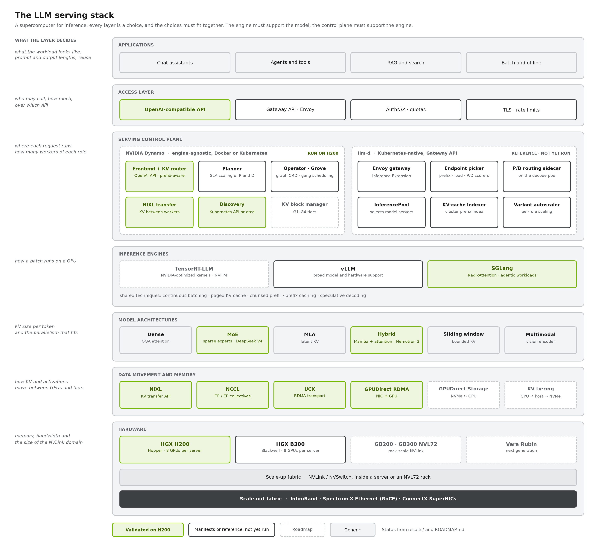
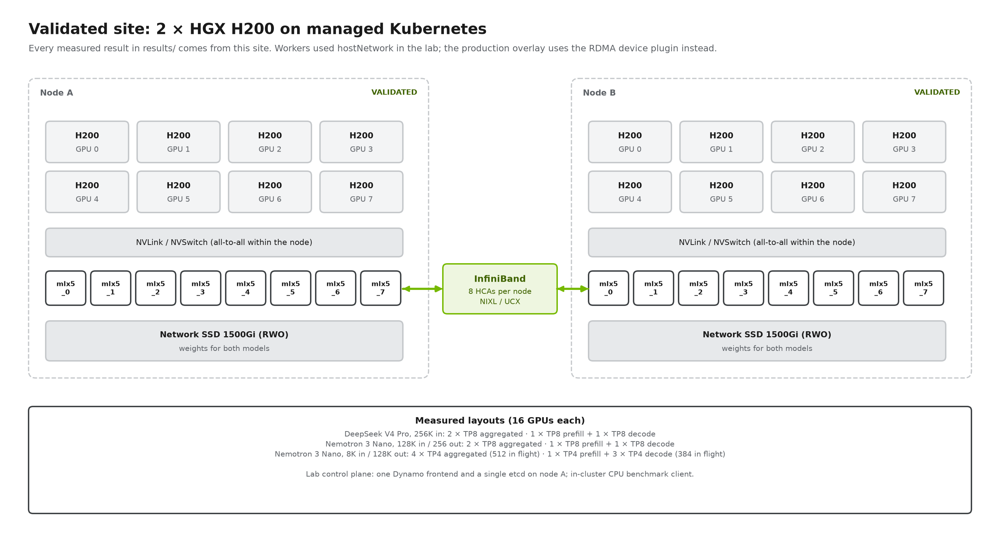
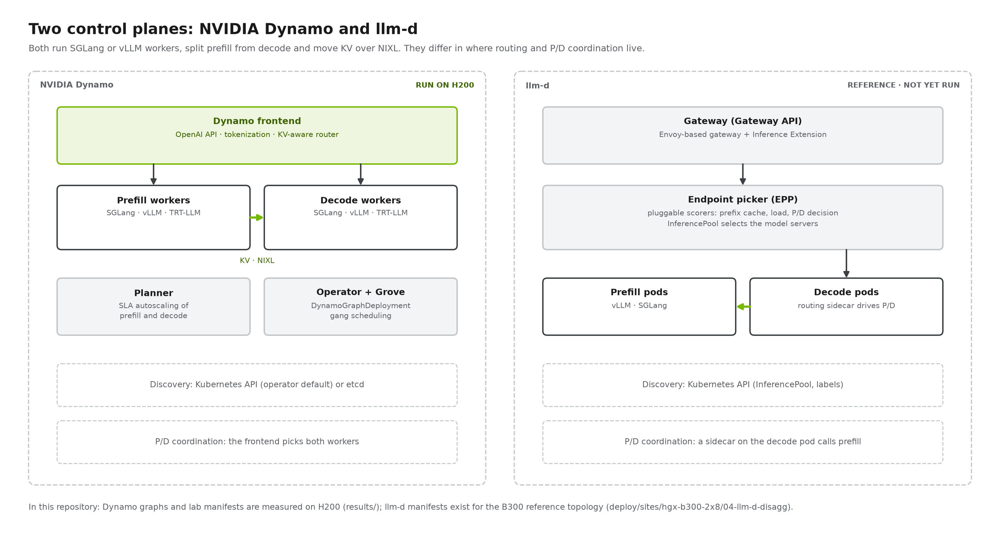
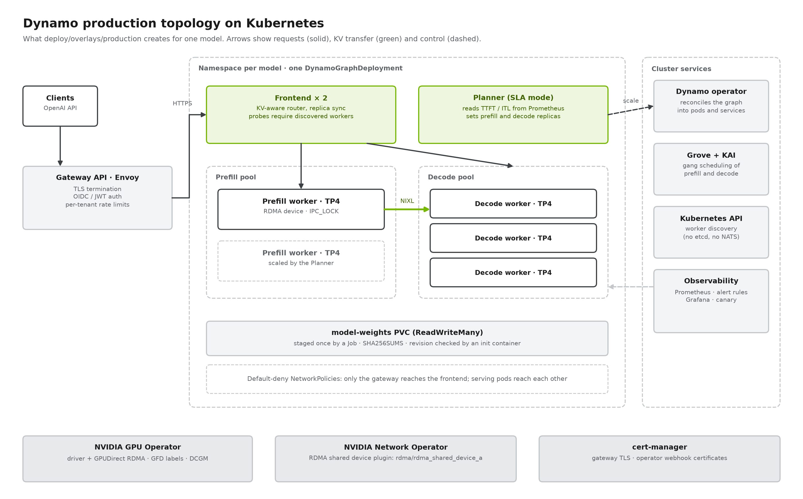

# LLM Inference Blueprint

A vendor-neutral reference architecture, deployment kit and benchmark methodology for
serving large language models. It treats the serving stack as a **supercomputer for
inference** in layers, where every layer is a choice and the choices must fit together:

- **Serving control plane:** NVIDIA Dynamo or llm-d
- **Inference engines:** SGLang, vLLM or TensorRT-LLM
- **Model architectures:** dense, MoE, MLA, hybrid Mamba and sliding window
- **Data movement and memory:** NIXL, NCCL, UCX, GPUDirect RDMA and Storage, KV tiering
- **Hardware:** Hopper, Blackwell and Rubin, scale-out HGX servers or scale-up NVL72 racks

It covers aggregated and disaggregated (prefill/decode) serving. Every measured number
comes from a recorded run in [results/](results/), with pinned images, request hashes and
cache-reset evidence. The measured path today is **Dynamo 1.4.0 + SGLang on 2 × HGX H200**.
llm-d, vLLM and the B300 tracks are reference manifests, and TensorRT-LLM is on the
[roadmap](ROADMAP.md). Everything not yet run is marked **UNVALIDATED**.

**Audience:** platform and ML infrastructure teams sizing and operating LLM inference on
NVIDIA GPUs.



### Stack coverage

| Layer | Option | Status in this repository |
| --- | --- | --- |
| Control plane | NVIDIA Dynamo 1.4.0 | Validated on H200 (lab manifests); operator-managed graphs and production overlay UNVALIDATED |
| Control plane | llm-d | Reference manifests for B300 ([04-llm-d-disagg](deploy/sites/hgx-b300-2x8/04-llm-d-disagg/)), UNVALIDATED |
| Engine | SGLang 0.5.16 | Validated on H200 |
| Engine | vLLM 0.26.0 | Reference tracks for B300 ([02](deploy/sites/hgx-b300-2x8/02-dynamo-disagg-vllm/), [04](deploy/sites/hgx-b300-2x8/04-llm-d-disagg/)), UNVALIDATED |
| Engine | TensorRT-LLM | [Roadmap](ROADMAP.md) |
| Hardware | HGX H200 / HGX B300 / NVL72 | Validated / reference / roadmap |

## Validated results: 2 × HGX H200

Three matched studies on the same 16 H200 GPUs, model checkpoint and image compared
aggregated replicas with disaggregated prefill/decode ([site](deploy/sites/nebius-h200-2x8/),
[analysis](blueprint/12-results-and-reconciliation.md)):

| Study | Layouts | Aggregated | Disaggregated |
| --- | --- | --- | --- |
| DeepSeek V4 Pro, 256K input, concurrency 4 | 2 × TP8 vs 1P + 1D TP8 | 141.45 s | 782.50 s |
| Nemotron 3 Nano, 128K in / 256 out, concurrency 4, 3 runs | 2 × TP8 vs 1P + 1D TP8 | 65.09 s mean, TPOT 4.35 ms | 105.48 s mean, TPOT 4.64 ms |
| Nemotron 3 Nano, 8K in / 128K out, at the KV limit, 3 runs | 4 × TP4 vs 1P + 3D TP4 | 34,677 output tok/s, worst ITL 40.4 s | 25,852 output tok/s, worst ITL 1.1 s |

**What the results say.** On two nodes with fixed TP8 or TP4 workers and a fixed P:D
ratio, aggregated serving was faster in every study (5.5×, 1.62×, 1.34×). Disaggregated
serving removed prefill-induced decode stalls: its worst inter-token gap was 1.1 s
against 40.4 s. The studies used prefill-only and decode-only extremes, so they do not
show where disaggregation wins. That is the next experiment: realistic input/output
lengths, open-loop load and goodput at a p99 SLO, with P:D ratios from 1:3 to 2:6
([experiments/01](experiments/01-pd-ratio-sweep/)).

Functional checks on the same site: streaming, non-streaming, tool calling and
long-context retrieval passed for DeepSeek V4 Pro; public-API and 128K retrieval checks
passed for Nemotron 3 Nano (see each study's report).



## What you get, and what you still own

| Area | From this repository | You still own |
| --- | --- | --- |
| Reproduce the measurements | Lab manifests exactly as measured ([deploy/sites](deploy/sites/)), drivers, datasets, notebooks, raw-result archives | Hardware and cluster access |
| Run in production | DynamoGraphDeployments ([deploy/base](deploy/base/)); production overlay with Gateway API + Envoy TLS/OIDC/rate limits, NetworkPolicies, RDMA via device plugin, Planner, KV router, two frontends ([deploy/overlays/production](deploy/overlays/production/)); operator install values ([deploy/operator](deploy/operator/)); observability ([deploy/observability](deploy/observability/)) — **UNVALIDATED** | Identity provider, DNS and certificates, storage class, SLO targets, capacity |
| Decide | Blueprint chapters 01–12, decision guide, engine-flag review | Your traffic profile and the final call |
| Measure | Open-loop load generator with goodput at SLO, sweeps, AIPerf-compatible export ([benchmarks](benchmarks/)) | Running it on your traffic |

## Deploy

**Production path (operator-managed, UNVALIDATED):** install the Dynamo operator with
[deploy/operator](deploy/operator/), then apply a model's graph from
[deploy/overlays/production](deploy/overlays/production/). Switching between aggregated and
disaggregated is an edit of one DynamoGraphDeployment.

```bash
cp deploy/site.env.example deploy/site.env        # cluster-specific values; git-ignored
python tools/render_site.py --env deploy/site.env deploy --out build/site
kubectl --context "$KUBE_CONTEXT" apply -k build/site/overlays/production/nemotron-3-nano-h200/aggregated
```

**Lab path (as measured):** the hand-written manifests behind every result are under each
H200 profile's `lab/` folder, e.g.
[nemotron-3-nano/lab](deploy/sites/nebius-h200-2x8/nemotron-3-nano/lab/).

### Validated deployment matrix

Only configurations with recorded results are listed. Everything else is in
[ROADMAP.md](ROADMAP.md) with a target date.

| Site | Model | Engine | Aggregated | Disaggregated | Path |
| --- | --- | --- | --- | --- | --- |
| 2 × HGX H200 | DeepSeek V4 Pro (262K context) | Dynamo 1.4.0 + SGLang | 2 × TP8 | 1 × TP8 prefill + 1 × TP8 decode | [lab](deploy/sites/nebius-h200-2x8/deepseek-v4-pro/lab/) |
| 2 × HGX H200 | Nemotron 3 Nano 30B-A3B (131K / 262K context) | Dynamo 1.4.0 + SGLang | 2 × TP8, 4 × TP4 | 1P + 1D TP8, 1P + 3D TP4 | [lab](deploy/sites/nebius-h200-2x8/nemotron-3-nano/lab/) |

## Architecture





## Blueprint

| # | Chapter | # | Chapter |
| --- | --- | --- | --- |
| 01 | [The serving stack](blueprint/01-serving-stack.md) | 07 | [Hardware, network and storage](blueprint/07-hardware-network-storage.md) |
| 02 | [Design principles](blueprint/02-design-principles.md) | 08 | [KV cache and offloading](blueprint/08-kv-cache-and-offloading.md) |
| 03 | [The disaggregation pattern](blueprint/03-disaggregation-pattern.md) | 09 | [Parallelism and sizing](blueprint/09-parallelism-and-sizing.md) |
| 04 | [Orchestration: Dynamo and llm-d](blueprint/04-orchestration-layer.md) | 10 | [Production operations](blueprint/10-production-operations.md) |
| 05 | [Inference engines](blueprint/05-inference-engines.md) | 11 | [Decision guide](blueprint/11-decision-guide.md) |
| 06 | [Model architectures](blueprint/06-model-architectures.md) | 12 | [Results and reconciliation](blueprint/12-results-and-reconciliation.md) |

Reference: [glossary](reference/glossary.md) · [engine flags](reference/engine-flags.md) ·
[troubleshooting](reference/troubleshooting.md) · [upstream verification](reference/upstream-verification.md) ·
[pinned sources](reference/sources.md).

## Next measurements

[experiments/](experiments/) holds ready-to-run plans for the next cluster session, each with a
checklist and a preflight check (`tools/preflight.py`). In priority order: the P:D ratio sweep
with goodput at SLO, KV-router validation, a Planner demonstration, reliability confirmations,
the DeepSeek DP-attention/EP/MTP layout, overlap scheduling, prefill chunk size, resilience and
soak, and B300 validation.

## Reference topology (not yet run)

The repository also contains a reference design for **2 × HGX B300** serving
**Nemotron 3 Ultra 550B-A55B NVFP4**: aggregated, Dynamo P/D on vLLM and SGLang, and llm-d
([deploy/sites/hgx-b300-2x8](deploy/sites/hgx-b300-2x8/)), with single-node-debugging Docker
Compose files in [deploy/legacy-compose](deploy/legacy-compose/). These manifests pass the
offline tests. The only hardware evidence is a
[manual Docker deployment](reference/manual-docker-walkthrough.md) in which both disaggregated
vLLM workers initialized and registered on the reference hosts. End-to-end transfer, the
Kubernetes tracks and benchmarks have not run. **UNVALIDATED**; validation is
[experiments/09](experiments/09-b300-reference-validation/).


## Pinned versions

| Component | Version |
| --- | --- |
| NVIDIA Dynamo (operator, frontend, Planner) | 1.4.0 (`v1.4.0`, commit `0301494`); images pinned by digest |
| SGLang in the Dynamo runtime | 0.5.16 |
| vLLM in the Dynamo runtime | 0.26.0 (B300 reference tracks) |
| Grove / KAI scheduler (pinned by dynamo-platform 1.4.0) | v0.1.0-alpha.12-rc1 / v0.13.4 |
| NVIDIA GPU Operator / Network Operator | v26.7.1 / v26.7.0 |
| Gateway API / Envoy Gateway / cert-manager | v1.3.0 / v1.4.2 / v1.17.2 |

Sources and verification: [reference/sources.md](reference/sources.md),
[reference/upstream-verification.md](reference/upstream-verification.md).

## Repository layout

| Path | Contents |
| --- | --- |
| [blueprint/](blueprint/) | Architecture chapters 01–12 |
| [deploy/](deploy/) | `base/` (Dynamo graphs), `overlays/` (lab, production), `operator/`, `observability/`, `sites/` (H200 validated, B300 reference), `legacy-compose/` |
| [benchmarks/](benchmarks/) | Load generators, metrics, sweeps and methodology |
| [experiments/](experiments/) | Prepared, not yet run, cluster experiments |
| [results/](results/) | Study summaries and CSVs; raw evidence in release archives ([ARCHIVE.md](results/ARCHIVE.md)) |
| [notebooks/](notebooks/) | Analysis notebooks that read `results/` offline |
| [reference/](reference/) | Glossary, engine flags, troubleshooting, upstream verification, model catalog |
| [tools/](tools/) | Renderers (graphs, overlays, experiments, diagrams, site values), validation, preflight |
| [tests/](tests/) | Offline tests: `python -m pytest -q` and `python tools/validate.py` |

## Status

Offline checks pass: unit and consistency tests, and strict schema validation of every
manifest and rendered overlay against Dynamo 1.4.0, Kubernetes 1.33, Gateway API v1.3.0,
Envoy Gateway v1.4.2, Prometheus Operator v0.83.0, cert-manager v1.17.2 and Network
Operator v26.7.0 CRDs. They prove consistency, not that the production path works on your
hardware. Changes and open verification items: [REVIEW-CHANGELOG.md](REVIEW-CHANGELOG.md).
