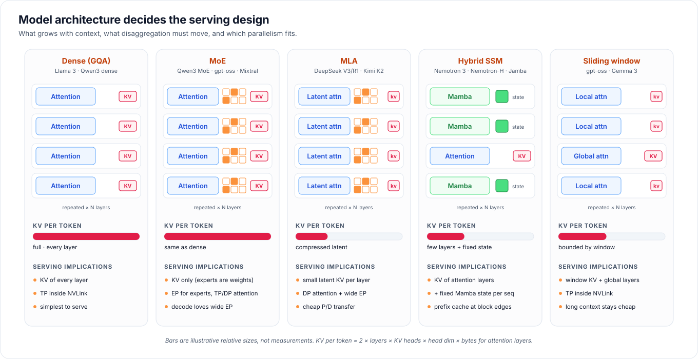

# 06 · Model architectures

[Home](../README.md) › [Blueprint](README.md) › 06 · Model architectures

The model is the program the serving OS runs, and its architecture sets the resource profile. Two models of the same parameter count can need completely different serving designs.



## The three numbers that matter

1. **KV (and state) bytes per token.** This decides how many sequences fit in GPU memory, and how much disaggregation must move.
2. **Weight bytes versus active compute per token.** This decides memory footprint and whether expert parallelism pays.
3. **What grows with context.** Linear (full attention), bounded (sliding window), constant (SSM state) or compressed (MLA).

```text
Full attention layer, per token:   KV = 2 × KV_heads × head_dim × bytes
Whole model, per token:           KV = Σ over attention layers
Per sequence:                     KV × context_length  (+ fixed SSM state for hybrid models)
```

## Families

### Dense decoder with GQA
Examples: Llama 3, Qwen3 dense models. Every layer has attention, and grouped-query attention (GQA) shares K/V heads across query heads to shrink KV. KV grows linearly with context in every layer.
**Serving:** tensor parallelism inside the NVLink domain. P/D transfers move the KV of every layer. This is the most predictable family and the default for sizing examples.

### Mixture of Experts (MoE)
Examples: Qwen3 MoE, gpt-oss, Mixtral, and the DeepSeek and Kimi families. Each MoE layer routes every token to a few of many experts, so total parameters are large but active compute per token is small.
**Serving:** the KV cache is the same as a dense model with the same attention; experts are weights, not cache. Expert parallelism (EP) spreads experts over GPUs with all-to-all token exchange. **Decode benefits from wide EP** (large batches across many GPUs) while prefill prefers smaller EP. That mismatch is a strong reason to disaggregate large MoE, ideally on rack-scale NVLink.

### Multi-head Latent Attention (MLA)
Examples: DeepSeek V3 and R1, Kimi K2. MLA caches a **compressed latent vector** per token per layer (hundreds of elements) instead of full per-head K and V, which reconstruct on the fly.
**Serving:** KV per token is several times smaller than an equivalent GQA model, so long contexts and P/D transfers are cheap. Attention is usually run **data-parallel** (DP attention) because the latent cache does not shard well by head, combined with wide EP for the MoE layers.

### Hybrid SSM (Mamba + attention)
Examples: NVIDIA Nemotron-H and Nemotron 3 (the reference model here), Jamba, and hybrids with linear-attention layers. Most layers are state-space (Mamba) layers that keep a **fixed-size state per sequence**; a minority are attention layers with a normal KV cache.
**Serving:** memory grows slowly with context, only in the attention layers. P/D must transfer **both** the attention KV and the SSM state. Prefix caching needs state snapshots at block boundaries; the reference vLLM worker uses `--mamba-cache-mode align` for this. Engines need hybrid-aware KV managers, which is why the reference deployment keeps NVIDIA's pinned image and flags.

### Sliding-window and local attention
Examples: gpt-oss and Gemma 3 (interleaved local and global layers). Local layers only attend to a fixed window, so their KV is bounded; global layers grow normally.
**Serving:** long contexts stay affordable. KV managers must evict window-expired blocks per layer type. P/D moves window KV plus global-layer KV.

### Multimodal
Vision-language and audio models add an **encoder** stage before prefill. It is compute-heavy and has no KV cache of its own. It can be scaled as a separate stage (E/P/D disaggregation) and benefits from caching repeated media.

## Implications at a glance

| Family | KV grows with | P/D payload | Parallelism fit | Watch out for |
|---|---|---|---|---|
| Dense GQA | context × all layers | full KV | TP ≤ NVLink domain | KV capacity at long context |
| MoE | same as its attention | KV only | EP for experts; TP or DP attention | all-to-all bandwidth; expert load balance |
| MLA | context × layers, compressed | small latent KV | DP attention + wide EP | engine-specific kernels; TP sharding of latent |
| Hybrid SSM | context × few layers | KV + per-sequence SSM state | TP | prefix caching at block edges; hybrid KV manager support |
| Sliding window | window (local) + context (global) | window + global KV | TP | per-layer eviction logic |
| Multimodal | per its text backbone | + encoder outputs | separate encode pool | media preprocessing cost |

**Speculative decoding** (MTP heads, EAGLE draft models) sits on top of any family. It trades extra decode compute for fewer steps, and it changes decode-pool sizing.

## The reference model

The deployments use **NVIDIA Nemotron 3 Ultra 550B-A55B (NVFP4)**. It combines three families: hybrid Mamba + attention, MoE with about 55B active parameters, and NVFP4 weights with FP8 KV. It exercises the hard cases: hybrid state transfer in P/D, block-aligned prefix caching, and model-specific kernels. The catalog of other profiles, and how to switch, is in [reference/models.md](../reference/models.md).

---

**Next:** [07 · Hardware, network and storage](07-hardware-network-storage.md)
