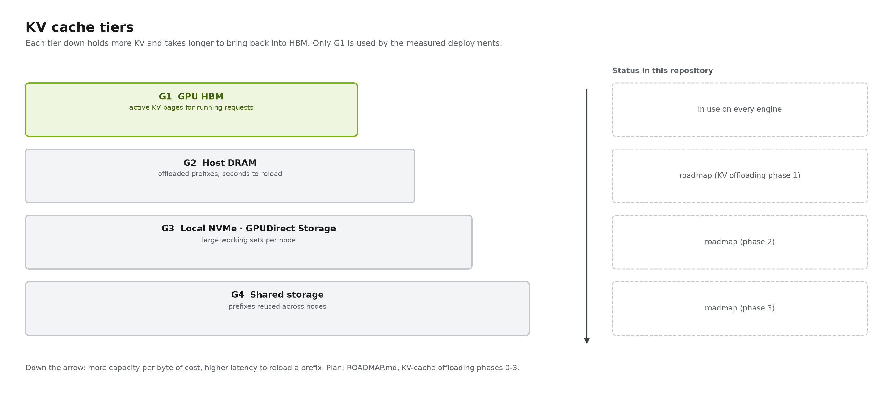

# 08 · KV cache and offloading

[Home](../README.md) › [Blueprint](README.md) › 08 · KV cache and offloading

**Executive summary.** Prefix caching and KV-aware routing are in use in every deployment; offloading KV to host memory, NVMe and shared storage is designed here and on the roadmap. KV is tenant data and needs isolation and expiry.

| What you get from this repository | What you still own |
| --- | --- |
| Prefix caching and KV-router configuration; an offloading design and plan | Offload tiers, storage and retention policy |

The KV cache is the per-request state the engine keeps in GPU memory. Managing it well (sharing it, routing to it, paging it across tiers) is the largest efficiency lever after the hardware itself.

> **Status.** Prefix caching and KV-aware routing are deployed in every reference track. Offloading to host memory, NVMe with GPUDirect Storage, and shared storage is **designed here and planned** in [ROADMAP.md](../ROADMAP.md). The configuration sketches on this page are unvalidated.

## Three mechanisms

| Mechanism | What it does | Where it lives |
|---|---|---|
| **Paged KV + prefix caching** | KV in fixed-size blocks. Blocks of a common prefix are reused instead of recomputed. | Engine |
| **KV-aware routing** | The router tracks which worker holds which blocks (from engine KV events) and sends each request to the best overlap, balanced against load | Control plane |
| **Tiered offloading** | Evicted blocks move to host DRAM, NVMe or shared storage, then come back on a hit instead of being recomputed | Engine connector + KV manager |

## Why offload

GPU memory holds only the active working set. When a request finishes, or an agent pauses to run a tool, its blocks get evicted, and a returning conversation must recompute its whole prefix.

Illustrative numbers, using the dense 70B-class example (about 160 KiB of KV per token):

| | Value |
|---|---|
| KV of one 256K-token agent session | ≈ 40 GiB |
| GPU memory left for KV on one 8-GPU node | roughly 1.3–1.5 TiB, so only a few dozen such sessions stay resident |
| Recompute that prefix | many seconds of all 8 GPUs, on **every** return to the session |
| Reload it from local NVMe at ~50 GB/s aggregate | ≈ 0.8 s, while the GPUs stay free |
| Reload it from host DRAM at ~100 GB/s or more | ≈ 0.4 s |

**Reuse wins whenever reload time is less than recompute time.** Multi-turn chat, agents, RAG over shared documents and long system prompts all benefit.

## The hierarchy



| Tier | Capacity | Bandwidth | Scope | Typical content |
|---|---|---|---|---|
| **G1** GPU HBM | smallest | fastest | one worker | sequences being decoded |
| **G2** host DRAM | similar to or larger than HBM | PCIe / C2C | one node | hot prefixes just evicted |
| **G3** local NVMe | 10× or more | moderate; GDS avoids CPU copies | one node | warm sessions and documents |
| **G4** shared storage | largest | network-bound | whole cluster | prefixes any worker can reuse |

The G1–G4 naming follows NVIDIA Dynamo's KV Block Manager.

## GPUDirect Storage

Without GDS, a KV read from NVMe goes through a host bounce buffer: one DMA into CPU memory, then a second copy into GPU memory. That costs CPU cycles and host memory bandwidth. With GDS, the NVMe controller DMAs **directly into GPU HBM** through the PCIe switch it shares with the GPU.

| Requirement | Detail |
|---|---|
| Kernel support | `nvidia-fs` (from `nvidia-gds`) or upstream P2PDMA on supported driver/kernel pairs. The GPU Operator can deploy it on Kubernetes. |
| Filesystem | Local XFS/ext4 with `O_DIRECT`, or a GDS-enabled parallel file system for G4 |
| Topology | NVMe drives under the same PCIe switch as the GPUs that read them |
| API | cuFile, used through **NIXL's GDS backends**. The same library moves KV between workers. |
| Validation | `gdscheck -p` for the platform, `gdsio` for throughput |

## Offloading with disaggregation

The two combine naturally:

1. The router checks **all tiers** for the longest cached prefix.
2. The prefill worker **onboards** cached blocks from G2, G3 or G4, and computes only the new suffix.
3. KV moves prefill → decode over the fabric as usual.
4. Blocks evicted from HBM are **offloaded** down the hierarchy instead of being dropped.

**Open design questions:** which role owns the tiers (prefill, both, or a shared G4 only), write-through or write-back, per-tier eviction policy, how hybrid models' SSM state is offloaded, and tenant isolation and encryption for cached prompts.

## Software options

| Option | Engines | Tiers | Notes |
|---|---|---|---|
| **Dynamo KV Block Manager (KVBM)** | G1–G4 | Uses NIXL for tier moves, including GDS. Combines with NIXL P/D transfer. |
| **LMCache** | CPU, disk, remote backends | Used by llm-d's tiered prefix caching |
| **vLLM native offloading** | CPU | The simplest first step |
| **SGLang HiCache** | host memory + pluggable storage | Hierarchical radix cache |
| **NIXL storage backends** | GDS, POSIX, object | The data mover |

**Candidate configuration (unvalidated).** Dynamo's KVBM documentation describes enabling it roughly as follows:

```bash
# Illustrative only. Verify names against the pinned Dynamo release.
export DYN_KVBM_CPU_CACHE_GB=512        # G2 per worker
export DYN_KVBM_DISK_CACHE_GB=4096      # G3 per worker
python3 -m dynamo.vllm <existing flags> --connector kvbm           # aggregated
python3 -m dynamo.vllm <existing flags> --connector kvbm nixl      # disaggregated
```

SGLang's equivalents include `--enable-hierarchical-cache`, `--hicache-ratio` and `--hicache-storage-backend`, also unvalidated here.

## Host preparation preview

```bash
nvidia-smi topo -m                   # GPU ↔ NVMe ↔ NIC PCIe affinity
nvme list
lsmod | grep nvidia_fs               # after installing nvidia-gds for your CUDA version
/usr/local/cuda/gds/tools/gdscheck -p
sudo mkfs.xfs /dev/nvme1n1 && sudo mkdir -p /mnt/kvcache0 && sudo mount -o noatime /dev/nvme1n1 /mnt/kvcache0
/usr/local/cuda/gds/tools/gdsio -f /mnt/kvcache0/gdsio.dat -d 0 -w 8 -s 10G -i 1M -x 0 -I 0   # GPUDirect read, GPU 0
```

The reference hosts have about 973 GiB free on the root disk, which the model and images already use. A G3 tier needs **dedicated NVMe drives**.

## Measuring the benefit

Use the `agentic` dataset from [benchmarks/](../benchmarks/) with `--think-time` long enough to force eviction and enough sessions to exceed GPU memory. Compare the same track with and without offloading:

- **Primary:** TTFT on turns 2 and later (p50 and p99).
- **Secondary:** hit rate per tier, bytes read per tier, prefill time saved, throughput, and CPU load (GDS should keep it low).
- **Guardrails:** identical outputs at temperature 0, and no increase in failed requests.

---

**Next:** [09 · Parallelism and sizing](09-parallelism-and-sizing.md)
