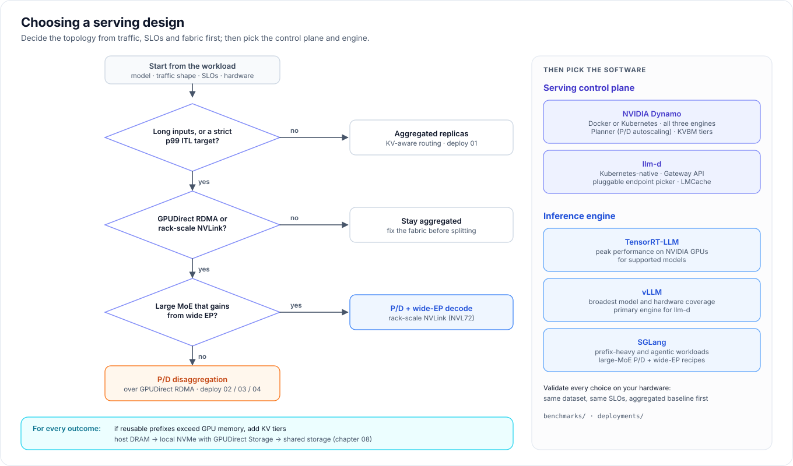

# 11 · Decision guide

[Home](../README.md) › [Blueprint](README.md) › 11 · Decision guide

Choose the **topology** from the workload and the fabric first. The **software** comes second, because topology decisions are the expensive ones to reverse.

## Questions, in order

1. **What is the model?** Family, size, precision ([chapter 06](06-model-architectures.md)). This fixes KV bytes per token and the parallelism that fits.
2. **What is the hardware domain?** 8-GPU servers or rack-scale NVLink, and whether GPUDirect RDMA is available ([chapter 07](07-hardware-network-storage.md)).
3. **What is the traffic shape?** Input and output lengths, arrival rate, prefix reuse, and the p99 TTFT and ITL targets.
4. **Which topology?** Use the tree above: aggregated, P/D over RDMA, or P/D with wide-EP decode.
5. **Which engine?** From model support and performance measured on your hardware ([chapter 05](05-inference-engines.md)).
6. **Which control plane?** From platform (Docker or Kubernetes), engine and operating model ([chapter 04](04-orchestration-layer.md)).
7. **Does KV need tiers?** Yes if reusable prefixes exceed GPU memory ([chapter 08](08-kv-cache-and-offloading.md)).

## Reference scenarios

| Scenario | Topology | Engine | Control plane | Start from |
|---|---|---|---|---|
| **Chat assistant**, short prompts, 1–2 HGX servers, throughput first | Aggregated replicas, KV-aware routing | vLLM or SGLang | Dynamo or llm-d | [deploy/01](../deploy/sites/hgx-b300-2x8/01-aggregated/) |
| **Long-context RAG or agents** with p99 ITL SLO, HGX servers with InfiniBand | P/D over GPUDirect RDMA, tune the P:D ratio | vLLM, SGLang or TensorRT-LLM | Dynamo (Planner) or llm-d | [deploy/02](../deploy/sites/hgx-b300-2x8/02-dynamo-disagg-vllm/), [03](../deploy/sites/hgx-b300-2x8/03-dynamo-disagg-sglang/), [04](../deploy/sites/hgx-b300-2x8/04-llm-d-disagg/) |
| **Large MoE** (DeepSeek-, Kimi-class) at scale on GB200/GB300 NVL72 | P/D, wide-EP decode inside the NVLink domain, DP attention for MLA | SGLang or TensorRT-LLM (vLLM also supports wide EP) | Dynamo or llm-d wide-EP guides | [ROADMAP](../ROADMAP.md) |
| **Hybrid SSM** (Nemotron 3) on HGX B300 | Aggregated baseline, then P/D with hybrid-aware KV transfer | vLLM (NVIDIA-pinned image) | Dynamo | [deploy/01](../deploy/sites/hgx-b300-2x8/01-aggregated/) → [02](../deploy/sites/hgx-b300-2x8/02-dynamo-disagg-vllm/) |
| **Multi-turn heavy reuse** (coding agents, support bots) | Any of the above + KV tiers (DRAM → NVMe with GDS) | engine with an offload connector | Dynamo KVBM or llm-d + LMCache | [chapter 08](08-kv-cache-and-offloading.md) |
| **Kubernetes platform team** standardizing on Gateway API | Per workload | vLLM | llm-d (or KServe on llm-d) | [deploy/04](../deploy/sites/hgx-b300-2x8/04-llm-d-disagg/) |
| **Bare-metal PoC** before Kubernetes exists | Per workload | any | Dynamo on Docker Compose | [deploy/](../deploy/) Docker guides |
| **Next-generation racks** (Vera Rubin with Rubin CPX) | Hardware-specialized P/D: context on CPX, decode on HBM GPUs | per vendor support | per vendor support | [chapter 03](03-disaggregation-pattern.md#variants-of-the-pattern) |

## Anti-patterns

| Anti-pattern | Why it hurts | Instead |
|---|---|---|
| Disaggregating without RDMA | KV transfer over TCP can exceed prefill time | Aggregated with KV-aware routing until the fabric is ready |
| Round-robin load balancing across LLM workers | Destroys prefix-cache locality | KV-aware routing |
| TP across servers over the scale-out fabric | Every-layer all-reduce over NICs | TP inside NVLink; PP or P/D across servers |
| Sizing from peak FLOPs | Ignores memory-bound decode and SLOs | Measure Tp and Sd at the SLOs ([chapter 09](09-parallelism-and-sizing.md)) |
| Mixing images or revisions between prefill and decode | Silent KV corruption or crashes | Pin by digest and SHA, verify at startup |
| Comparing engines at different precisions | Measures precision, not engines | Record and match KV and weight dtypes |
| A single latency number on the dashboard | Hides which pool to scale | Separate TTFT, ITL and transfer metrics |

---

**Back to:** [Blueprint index](README.md) · **Implement it:** [deploy/](../deploy/)
