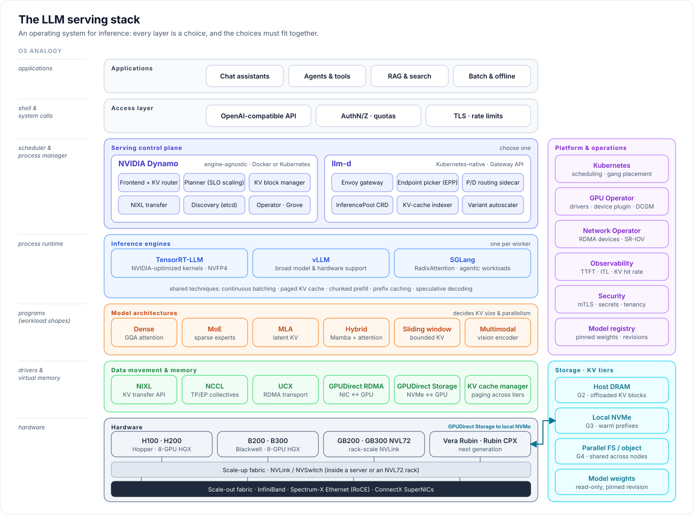

# The LLM Inference Blueprint

[Home](../README.md) › Blueprint

A vendor-neutral architecture guide for serving large language models in production. It describes the **serving stack** layer by layer, the design principles that hold across implementations, and how to choose between today's options: **llm-d or NVIDIA Dynamo** as the control plane, **TensorRT-LLM, vLLM or SGLang** as the engine, across **dense, MoE, MLA and hybrid** models on **Hopper, Blackwell and Rubin** hardware.

## Serving as an operating system

An inference platform does for a model what an operating system does for programs. It schedules work, manages scarce memory, moves data between devices, and isolates tenants. The analogy is useful because each layer has a clear OS counterpart, with clear responsibilities.

| Layer | OS counterpart | Responsibility | You choose | Chapter |
|---|---|---|---|---|
| Access | Shell & system calls | Stable API, identity, quotas | OpenAI-compatible API, gateway | [10](10-production-operations.md) |
| Serving control plane | Scheduler & process manager | Route requests, place and scale workers, coordinate phases | **Dynamo** or **llm-d** | [04](04-orchestration-layer.md) |
| Inference engine | Process runtime | Batch, schedule and execute tokens on GPUs | **TensorRT-LLM**, **vLLM**, **SGLang** | [05](05-inference-engines.md) |
| Model architecture | Programs (workload shape) | Decides KV size, compute profile, parallelism fit | dense, MoE, MLA, hybrid SSM… | [06](06-model-architectures.md) |
| Data movement & memory | Drivers, IPC & virtual memory | Move KV between GPUs and tiers; page KV like memory | NIXL, NCCL, UCX, GPUDirect, KV managers | [07](07-hardware-network-storage.md), [08](08-kv-cache-and-offloading.md) |
| Hardware | Hardware | Compute, HBM, scale-up and scale-out fabrics, storage | H200, B300, GB300 NVL72, Rubin | [07](07-hardware-network-storage.md) |

The analogy is more than decoration. PagedAttention, the KV-cache design in vLLM, was modeled on OS virtual-memory paging. KV-cache offloading is swap. The KV-aware router is a locality-aware scheduler.

## Chapters

| # | Chapter | The question it answers |
|---|---|---|
| 01 | [The serving stack](01-serving-stack.md) | What are the layers, and what contract sits between each pair? |
| 02 | [Design principles](02-design-principles.md) | Which rules hold no matter which products you pick? |
| 03 | [The disaggregation pattern](03-disaggregation-pattern.md) | Why split prefill from decode, and how is that like microservices? |
| 04 | [Orchestration layer: Dynamo and llm-d](04-orchestration-layer.md) | Where do routing, P/D coordination and autoscaling live? |
| 05 | [Inference engines: TensorRT-LLM, vLLM, SGLang](05-inference-engines.md) | What does each engine do best, and how do they interoperate? |
| 06 | [Model architectures](06-model-architectures.md) | How do attention variants, MoE and SSM layers change the design? |
| 07 | [Hardware, network and storage](07-hardware-network-storage.md) | Where can KV move, and how fast? Scale-up or scale-out? |
| 08 | [KV cache and offloading](08-kv-cache-and-offloading.md) | How do you treat KV cache as a tiered, first-class resource? |
| 09 | [Parallelism and sizing](09-parallelism-and-sizing.md) | TP, EP, PP, DP: where does each go, and how many workers do you need? |
| 10 | [Production operations](10-production-operations.md) | What changes from PoC to production: SLOs, observability, security? |
| 11 | [Decision guide](11-decision-guide.md) | Given my model, hardware and traffic, which stack should I deploy? |

## How the blueprint relates to the rest of the repository

- **[deployments/](../deployments/)** implements parts of the blueprint on real hardware, as hand-written Docker and Kubernetes files: aggregated and disaggregated serving with Dynamo on vLLM and SGLang, plus llm-d.
- **[benchmarks/](../benchmarks/)** measures deployments the same way, so architecture choices are decided by data.
- **[ROADMAP.md](../ROADMAP.md)** lists what is designed here but not yet implemented, such as TensorRT-LLM tracks and KV-cache offloading with GPUDirect Storage.

Statements about products reflect the versions pinned in [reference/sources.md](../reference/sources.md). The ecosystem moves quickly, so verify version-specific capabilities against current release notes.
