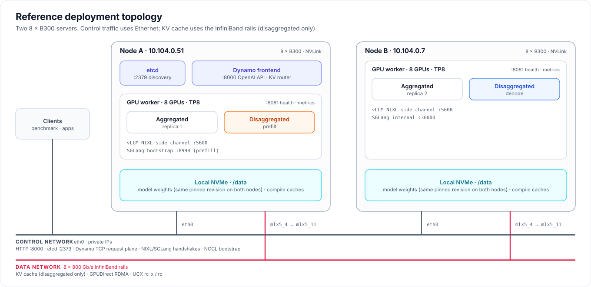

# Reference deployments

[Home](../README.md) › Deployments

Runnable implementations of the [blueprint](../blueprint/). Each track is one combination of **orchestrator × engine × topology**, delivered as hand-written, commented files for **Docker Compose** and **Kubernetes**. Each track folder has a step-by-step guide covering deploy, verify, see results and clean up.

## Deployment matrix

| # | Track | Control plane | Engine | Topology | Docker | Kubernetes | Status |
|---|---|---|---|---|---|---|---|
| 00 | [Prerequisites](00-prerequisites/) | n/a | n/a | n/a | ✓ | ✓ | Hosts, network, RDMA test, model download |
| 01 | [Aggregated](01-aggregated/) | Dynamo | vLLM | 1–2 full replicas | [guide](01-aggregated/vllm/docker/) | [guide](01-aggregated/vllm/kubernetes/) | Reference baseline |
| 01 | [Aggregated](01-aggregated/) | Dynamo | SGLang | 1–2 full replicas | [guide](01-aggregated/sglang/docker/) | [guide](01-aggregated/sglang/kubernetes/) | Not yet run on hardware |
| 02 | [Disaggregated](02-dynamo-disagg-vllm/) | Dynamo | vLLM | prefill + decode, NIXL over IB | [guide](02-dynamo-disagg-vllm/docker/) | [guide](02-dynamo-disagg-vllm/kubernetes/) | Worker setup initialized on reference hosts |
| 03 | [Disaggregated](03-dynamo-disagg-sglang/) | Dynamo | SGLang | prefill + decode, NIXL over IB | [guide](03-dynamo-disagg-sglang/docker/) | [guide](03-dynamo-disagg-sglang/kubernetes/) | Experimental |
| 04 | [Disaggregated](04-llm-d-disagg/) | llm-d | vLLM / SGLang | prefill + decode, NIXL over IB | n/a | [vLLM](04-llm-d-disagg/vllm/) · [SGLang](04-llm-d-disagg/sglang/) | Generated manifests, Qwen 480B |
| 05 | [DeepSeek V4 Pro / H200](05-deepseek-v4-pro-h200/) | Dynamo | SGLang | 2 × TP8 aggregated, or prefill TP8 + decode TP8 | n/a | [guide](05-deepseek-v4-pro-h200/) | Nebius deployment; see guide for validation |
| · | Dynamo + TensorRT-LLM | Dynamo | TensorRT-LLM | agg and disagg | planned | planned | [Roadmap](../ROADMAP.md) |
| · | KV-cache offloading | Dynamo | vLLM | tiers: DRAM, NVMe with GDS | planned | planned | [Roadmap](../ROADMAP.md) |

## How to use this folder

1. Complete [00 · Prerequisites](00-prerequisites/) once.
2. Deploy [01 · Aggregated](01-aggregated/) with the engine you plan to compare. This is your baseline.
3. Deploy the disaggregated track for the same engine: [02](02-dynamo-disagg-vllm/) for vLLM or [03](03-dynamo-disagg-sglang/) for SGLang.
4. Measure both with the same dataset using [benchmarks/](../benchmarks/).
5. Optionally, compare the orchestration layer with [04 · llm-d](04-llm-d-disagg/).

## Conventions

- **Run commands from the repository root.** Each step names the node it runs on.
- **One track at a time.** Every track uses all 8 GPUs per node and the same host ports. Stop one before starting the next.
- **Docker site settings** live in [cluster.env.example](cluster.env.example): IPs, interface, InfiniBand devices and paths. Copy it to `deployments/cluster.env` on each node.
- **Kubernetes placement** uses node labels (`llm-serving/node=node-a|node-b`). Site settings live in each track's `01-site-config.yaml`, and pod IPs come from the Downward API.
- **Every folder has a `deployment.json` run record.** The benchmark copies it into each result, so results always state what was deployed.
- **Model:** NVIDIA Nemotron 3 Ultra 550B-A55B NVFP4 at a pinned revision, except track 04. [Switching models](../reference/models.md#switching-a-reference-deployment-to-another-model) is documented.

## Layer mapping

How the tracks map onto the [serving stack](../blueprint/01-serving-stack.md):

| Layer | 01 | 02 | 03 | 04 |
|---|---|---|---|---|
| Control plane | Dynamo frontend + KV router, etcd | same | same | llm-d gateway + endpoint picker + sidecar |
| Engine | vLLM or SGLang | vLLM | SGLang | vLLM or SGLang |
| Data movement | NCCL (TP) | NCCL + NIXL/UCX | NCCL + NIXL/UCX | NCCL + NIXL/UCX |
| Hardware | 1–2 × 8 × B300 | 2 × 8 × B300 + IB | 2 × 8 × B300 + IB | 2 × 8 × GPU + IB |
